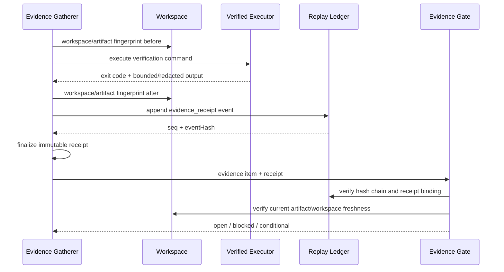

# OMK v0.90.9 — Algorithm Hardening & Reliability Detailed Patch

> **문서 상태:** 구현 진행 중 스냅샷 — 상세 패치 명세서(implementation-ready specification) 본문은 계획으로 유지  
> **대상 저장소:** `dmae97/omk`  
> **기준 릴리스:** `v0.90.8` (`9a39b64`, 2026-07-13 공개 릴리스)  
> **제안 버전:** `v0.90.9` (미출시; 패키지 버전은 현재 `0.90.8` 유지)  
> **작성 기준일:** 2026-07-14  
> **중요:** 이 문서는 실제 코드가 이미 적용되었다는 뜻이 아니다. 현재 공개 소스를 분석해 만든 **구현 계획·알고리즘·테스트·릴리스 기준**이며, 2026-07-17 진행 스냅샷은 ALG-003 일부 진행만 반영한다(아래 ‘진행 스냅샷 (2026-07-17)’ 참고).

---

## 진행 스냅샷 (2026-07-17) · ALG-003 부분 진행

> 상태만 기록한다. 아래 설계 본문은 여전히 `v0.90.9` **미출시** 기준의 계획·명세이며, 패키지 버전은 현재 `0.90.8`이다.

- **기준일:** 2026-07-17
- **직전 합계:** 36 / 77 (ALG-003 7 / 15)
- **이번 슬라이스에서 추가된 ALG-003 guardrail/API 조건 (정확히 5개):**
  1. `VerifiedEvidenceExecutor` 공개 SDK API
  2. 구조화된 `command`의 domain-separated digest 결합(`receiptCommandSha256`)
  3. receipt의 `laneId` 결합
  4. current artifact-set manifest freshness 판정(`receipt.core.workspaceAfter.manifestSha256`)
  5. replay-ledger 결합(`receipt.envelope.ledgerBinding.{seq,eventHash}`)
- **후속 CI callsite 슬라이스:** `executeVerifiedLocalBash()`가 OMK 로컬 shell identity와 `BashOperations`를 함께 구성하고, `.github/workflows/ci.yml`의 `dist/verify-ci.js` 단계가 release-consistency 검증을 이 경로로 실행한다. 이 슬라이스로 빌트인 CLI/bash **또는 CI** 조건 중 CI 분기를 1개 완료했다.
- **원자 조건 스냅샷:** ALG-003 **13 / 15**
- **전체 합계:** **42 / 77**
- **기존 작업 통합(새로 카운트 아님):** `EvidenceReceipt` v3 schema, atomic receipt store, workspace/artifact fingerprint 타입·계산은 이미 존재하던 코드를 **통합**한 것이며 이번 슬라이스 조건 수에 포함되지 않는다.
- **집계 증거:** focused evidence **112 / 112** 통과(실제 로컬 shell + CI runner callsite 4건 포함), 그리고 2026-07-17 후속 검증에서 저장소 루트 `npm run check` exit **0**.
- **명시적 비주장:** 이 스냅샷은 `npm run build`, 전체 `./test.sh` · `./omk-test.sh`, npm pack, 플랫폼(Linux/macOS/Windows/Bun) smoke 결과를 **주장하지 않는다**. 해당 명령은 이 슬라이스 범위가 아니며 릴리스 전 최종 검증에서 별도로 실행해야 한다.

### ALG-003 신뢰·범위 경계 (trust/scope boundaries)

- **callback 정직성:** `VerifiedEvidenceExecutor`에 전달되는 callback은 descriptor를 **있는 그대로 실행**하고, 합계 64 KiB 이하의 **이미 redaction된 bounded output**만 반환해야 한다. redaction·bound 책임은 callback/gatherer 측에 있다.
- **CI callsite 한정:** `.github/workflows/ci.yml`은 컴파일된 `dist/verify-ci.js`를 호출하고, 이 entry는 release-consistency command를 `executeVerifiedLocalBash()`와 `executor: "ci-runner"`로 실행한다. 기본 CLI·interactive·RPC·AgentSession bash 경로는 여전히 receipt executor에 연결되지 않는다.
- **fingerprint 범위:** workspace fingerprint는 **artifact-set 한정**이며 **Git fingerprint(`head` + dirty diff digest)는 포함하지 않는다**.
- **post-receipt 변형 정책 없음:** receipt 이후 관련 write가 발생한 경우 최신 mutation sequence로 evidence를 무효화하는 **일반화 정책은 아직 없다**(현재는 `workspaceAfter` manifest 재캡처 + ledger 결합에 한함).
- **보안 경계 아님:** receipt store와 evidence gate는 **OS 수준 격리가 아니다**. 강한 격리는 container/micro-VM/sandbox가 담당한다(본문 §3 비목표와 동일).

### 남은 ALG-003 원자 조건 (2개, 13/15 기준)

아래 항목은 완료로 선언하지 않는다.

- Git workspace fingerprint(`head` + dirty diff digest)와 post-receipt latest-mutation invalidation 일반화 — 현재 artifact-set manifest 재캡처에 한정.
- command 문자열 자체의 secret redaction 정책(redacted command + secure command hash).

### 남은 ALG-003 검증·회귀

- strict / prefer / legacy migration report의 end-to-end 통합 검증.
- ALG-003 fault-injection 매트릭스(§7.10) 전수 실행 및 receipt atomic write crash · symlink · untracked artifact 회귀 확대 — 현재 focused **112/112** + `npm run check`만 확인.

---

## 1. 패치 목적

v0.90.8은 다음 기반을 이미 갖추고 있다.

- provider-neutral agent runtime
- ordered path-safe tool-batch waves
- context-budget v2
- tamper-evident replay ledger
- evidence gate
- multi-agent/control-plane 구조

v0.90.9의 목표는 기능 수를 늘리는 것이 아니라, 아래 네 가지 런타임 불변식을 강화하는 것이다.

1. **도구 호출은 어떤 종료 경로에서도 반드시 닫힌다.**
2. **충돌하지 않는 도구는 더 많이 병렬화하되, 충돌 도구는 절대 겹치지 않는다.**
3. **완료 증거는 문자열 선언이 아니라 실제 실행 영수증에 결합된다.**
4. **중단·압축·재개·프로바이더 오류가 세션을 모호한 상태로 남기지 않는다.**

### 릴리스 핵심 문장

> OMK v0.90.9 closes every tool turn, schedules independent work through a deterministic resource DAG, binds evidence to fresh execution receipts, and makes session termination diagnosable and recoverable.

---

## 2. 현재 구현에서 확인된 핵심 문제

### 2.1 P0 — 중단 시 일부 tool call에 tool result가 생성되지 않을 수 있음

현재 `packages/agent/src/agent-loop.ts`는 다음 흐름을 가진다.

1. assistant가 여러 tool call을 생성한다.
2. sequential 또는 wave 실행 중 `AbortSignal`이 중단된다.
3. 실행 루프가 `break`한다.
4. 이미 완료된 호출의 tool result만 반환한다.
5. 나머지 tool call은 대응되는 tool result 없이 transcript에 남을 수 있다.

특히 현재 continuation guard는 **마지막 메시지가 assistant이면서 tool call을 직접 포함하는 경우**만 검사한다. 마지막 메시지가 일부 호출의 `toolResult`라면, 그 앞 assistant 메시지의 나머지 tool call이 미해결이어도 통과할 수 있다.

예시:

```text
assistant:
  call A
  call B
  call C

toolResult A
toolResult B

<abort>
```

이 상태에서 마지막 메시지는 `toolResult B`이므로 단순 tail 검사는 통과할 수 있지만, `call C`는 닫히지 않았다. 이후 provider 변환·재시도·세션 재개에서 프로토콜 오류가 발생할 수 있다.

#### 영향

- provider별 `tool_use/tool_result` 짝 불일치
- 세션 재개 실패
- compaction 이후 손상된 대화 상태 고착
- 모호한 “session ended” 또는 provider rejection
- replay ledger와 실제 transcript 간 의미 불일치

---

### 2.2 P0 — contiguous wave 스케줄러는 안전하지만 병렬성을 놓침

현재 `partitionToolBatchWaves()`는 source order를 유지하는 **연속 구간(contiguous run)** 방식이다.

예시:

```text
A: write x
B: write x
C: write y
```

현재 방식의 일반적인 결과:

```text
wave 1: A
wave 2: B, C
```

하지만 `C`는 `A`와 충돌하지 않으므로 아래가 더 효율적이다.

```text
wave 1: A, C
wave 2: B
```

즉 현재 구현은 안전하지만, 앞선 충돌 하나가 뒤의 독립 호출까지 대기시키는 **head-of-line blocking**을 만든다.

또한 현재 path 비교는 다음 장점이 있다.

- `/`와 `\` 정규화
- `.` / `..` lexical collapse
- 대소문자 무시 비교
- 부모·자식 경로 overlap 판정

그러나 다음 filesystem identity까지는 판별하지 않는다.

- symlink alias
- hardlink inode alias
- nearest-existing-ancestor realpath
- Windows drive/UNC canonical identity
- extension tool의 사용자 정의 resource scope

---

### 2.3 P0 — evidence gate가 “실제 검증 실행”보다 메타데이터 존재를 중심으로 판단함

현재 evidence item은 다음 필드를 가진다.

```ts
artifactPath?: string;
verificationCommand?: string;
hash?: string;
timestamp: string;
status: EvidenceStatus;
```

현재 gate는 만족 상태, 실패 증거 유무, hash 존재, verification command 존재, contract verdict 등을 확인하는 구조다.

문제는 다음을 gate 자체가 강하게 증명하지 못한다는 점이다.

- command가 실제로 실행됐는가
- exit code가 0이었는가
- 어떤 cwd·workspace revision에서 실행됐는가
- 검증 이후 artifact가 다시 바뀌지 않았는가
- artifact hash가 해당 실행과 인과적으로 연결되는가
- stdout/stderr가 어느 tool call에서 나온 것인가
- 증거가 마지막 write보다 최신인가

따라서 문자열 `"npm test"`와 hash 값이 존재하는 것만으로는 “현재 작업공간에 대해 npm test가 성공했다”는 사실을 충분히 증명하지 못한다.

---

### 2.4 P1 — context compaction과 transcript 무결성의 결합 규칙이 필요함

OMK에는 context-budget v2와 compaction 모듈이 이미 존재한다. v0.90.9에서는 이를 제거하거나 재작성하지 않고, 다음 불변식을 추가해야 한다.

- unresolved tool turn은 compact하지 않는다.
- transcript repair 이전에는 다음 provider call을 시작하지 않는다.
- 압축 결과는 어느 source range를 요약했는지 식별 가능해야 한다.
- 동일 압축이 반복 실행되는 thrashing을 막아야 한다.
- session revision이 바뀐 상태에서 오래된 compaction 결과를 덮어쓰지 않는다.
- evidence pointer, open lane, 최신 사용자 의도는 압축으로 사라지지 않는다.

---

### 2.5 P1 — 세션 종료 원인이 너무 일반화되면 복구가 어려움

공개 이슈 #13에는 새 초기화 이후 `omk init`, `omk chat`에서 “Chat Session Ended”가 반복된다는 증상이 보고돼 있다. 보고 정보만으로 정확한 root cause를 확정할 수는 없다.

그러나 현재 문제를 재현하지 못하더라도 v0.90.9에서 다음은 반드시 개선할 수 있다.

- 종료 사유의 typed classification
- 마지막 provider/tool/transcript 오류 기록
- retryable 여부
- 불완전 run journal 복구
- `session doctor` 검사
- 사용자에게 generic 종료 문구 대신 actionable reason 표시

---

### 2.6 P1 — custom provider를 native provider로 오인하는 doctor 경고

공개 이슈 #9에는 Kimi CLI가 custom OpenAI-compatible provider로 정상 구성된 상태에서도 native Moonshot 전제를 사용해 다음 경고를 낸다고 보고돼 있다.

- login 필요 경고
- native config 누락 경고
- native web tool 미탐지 경고

현재 `doctor-provider.ts`는 OMK의 `models.json` 또는 `auth.json`을 중심으로 provider 설정을 찾고, base URL 및 `/models`를 일반적으로 probe한다. v0.90.9에서는 provider origin을 명시적으로 분류하고, native 전용 진단을 custom endpoint에 적용하지 않아야 한다.

---

## 3. 우선순위와 릴리스 범위

| ID | 우선순위 | 패치 | 릴리스 차단 여부 |
|---|---:|---|---|
| ALG-001 | P0 | Tool Transcript Closure Protocol | 필수 |
| ALG-002 | P0 | Resource-Claim DAG Scheduler v2 | 필수 |
| ALG-003 | P0 | Execution-Bound Evidence Receipt v3 | 필수 |
| ALG-004 | P1 | Timeout·Cancellation·Late Settlement 정책 | 필수 |
| ALG-005 | P1 | Transactional Context Compaction | 필수 |
| REL-001 | P1 | Typed Session Termination & Recovery | 필수 |
| PRV-001 | P1 | Custom-provider-aware Doctor | 필수 |
| OBS-001 | P2 | 런타임 메트릭·진단 이벤트 | 권장 |
| PERF-001 | P2 | scheduler/receipt 성능 회귀 기준 | 권장 |

### 비목표

v0.90.9는 다음을 구현한 것으로 주장하지 않는다.

- OS 수준 sandbox
- filesystem/process/network 권한 시스템
- arbitrary JavaScript tool의 강제 종료
- 모델 품질 벤치마크 우위
- 모든 provider의 기능 동등성
- issue #13의 root cause 확정 없이 “완전 해결” 선언

OMK는 현재 프로세스를 실행한 사용자 권한으로 동작하므로, scheduler와 evidence gate는 **보안 경계가 아니다**. 강한 격리는 container·micro-VM·sandbox에서 제공해야 한다.

---

# 4. ALG-001 — Tool Transcript Closure Protocol

## 4.1 불변식

모든 assistant tool turn에 대해 다음이 성립해야 한다.

```text
assistant가 방출한 toolCall ID 집합
=
그 assistant turn 직후의 terminal toolResult ID 집합
```

추가 조건:

1. tool call 하나당 terminal result는 정확히 하나다.
2. result는 다음 상태 중 하나를 가져야 한다.

```ts
type ToolCallDisposition =
  | "completed"
  | "failed"
  | "blocked"
  | "aborted"
  | "timeout"
  | "skipped";
```

3. abort가 발생해도 미시작 호출에는 synthetic terminal result를 생성한다.
4. transcript가 닫히기 전에는 다음 provider call을 시작하지 않는다.
5. transcript repair는 idempotent해야 한다.
6. duplicate result, orphan result, duplicate call ID는 자동 추측으로 고치지 않고 fail closed한다.
7. repair가 일어나면 audit/replay event를 남긴다.

---

## 4.2 신규 파일

```text
packages/agent/src/tool-transcript-integrity.ts
```

권장 API:

```ts
export interface ToolTranscriptIssue {
  kind:
    | "missing-result"
    | "duplicate-result"
    | "orphan-result"
    | "duplicate-call-id"
    | "interleaved-non-result";
  assistantIndex?: number;
  messageIndex?: number;
  toolCallId?: string;
  toolName?: string;
}

export interface ToolTranscriptInspection {
  valid: boolean;
  issues: ToolTranscriptIssue[];
  openTurn?: {
    assistantIndex: number;
    missingCallIds: string[];
  };
}

export interface TranscriptRepairResult {
  messages: AgentMessage[];
  inserted: ToolResultMessage[];
  repaired: boolean;
}

export function inspectToolTranscript(
  messages: readonly AgentMessage[],
): ToolTranscriptInspection;

export function repairMissingToolResults(
  messages: readonly AgentMessage[],
  reason: "abort" | "resume" | "compaction" | "provider-retry",
): TranscriptRepairResult;

export function assertClosedToolTranscript(
  messages: readonly AgentMessage[],
): void;
```

---

## 4.3 검사 알고리즘

assistant tool-call turn마다 바로 뒤에 이어지는 `toolResult` 구간을 검사한다.

```ts
function inspectToolTranscript(messages: readonly AgentMessage[]) {
  const issues: ToolTranscriptIssue[] = [];

  for (let i = 0; i < messages.length; i++) {
    const message = messages[i];
    if (message.role !== "assistant") continue;

    const calls = message.content.filter(
      (part): part is AgentToolCall => part.type === "toolCall",
    );
    if (calls.length === 0) continue;

    const callById = new Map<string, AgentToolCall>();
    for (const call of calls) {
      if (callById.has(call.id)) {
        issues.push({
          kind: "duplicate-call-id",
          assistantIndex: i,
          toolCallId: call.id,
          toolName: call.name,
        });
      }
      callById.set(call.id, call);
    }

    const seen = new Set<string>();
    let cursor = i + 1;

    while (cursor < messages.length && messages[cursor].role === "toolResult") {
      const result = messages[cursor] as ToolResultMessage;

      if (!callById.has(result.toolCallId)) {
        issues.push({
          kind: "orphan-result",
          assistantIndex: i,
          messageIndex: cursor,
          toolCallId: result.toolCallId,
        });
      } else if (seen.has(result.toolCallId)) {
        issues.push({
          kind: "duplicate-result",
          assistantIndex: i,
          messageIndex: cursor,
          toolCallId: result.toolCallId,
        });
      } else {
        seen.add(result.toolCallId);
      }

      cursor++;
    }

    for (const call of calls) {
      if (!seen.has(call.id)) {
        issues.push({
          kind: "missing-result",
          assistantIndex: i,
          toolCallId: call.id,
          toolName: call.name,
        });
      }
    }
  }

  return {
    valid: issues.length === 0,
    issues,
  };
}
```

### 자동 복구 허용 범위

자동 복구는 다음 조건을 모두 만족할 때만 수행한다.

- issue 종류가 `missing-result`뿐이다.
- assistant turn 안에 duplicate call ID가 없다.
- 이미 존재하는 result에 duplicate가 없다.
- missing result의 tool name과 ID를 원본 assistant message에서 확정할 수 있다.

그 외에는 session을 손상 상태로 표시하고 명시적인 repair command를 요구한다.

---

## 4.4 synthetic result 형식

```ts
function createSyntheticTerminalResult(
  call: AgentToolCall,
  disposition: "aborted" | "timeout" | "skipped",
  reason: string,
): ToolResultMessage {
  return {
    role: "toolResult",
    toolCallId: call.id,
    toolName: call.name,
    content: [
      {
        type: "text",
        text: `Tool ${disposition}: ${reason}`,
      },
    ],
    details: {
      omk: {
        schema: "tool-result/v2",
        synthetic: true,
        disposition,
        reason,
      },
    },
    isError: true,
    timestamp: Date.now(),
  };
}
```

### 주의

synthetic result는 “도구가 실행됐음”을 의미하지 않는다. provider transcript를 닫기 위한 terminal artifact다. replay ledger에는 반드시 다음을 구분해 기록한다.

```json
{
  "event": "tool_result",
  "synthetic": true,
  "disposition": "aborted",
  "executionStarted": false
}
```

---

## 4.5 `agent-loop.ts` 변경

현재 batch 함수가 일부 result만 반환할 수 있는 구조를 다음처럼 바꾼다.

```ts
interface ToolCallExecutionRecord {
  index: number;
  toolCall: AgentToolCall;
  disposition: ToolCallDisposition;
  resultMessage: ToolResultMessage;
  executionStarted: boolean;
  startedAt?: number;
  endedAt: number;
}

interface ExecutedToolCallBatch {
  records: ToolCallExecutionRecord[];
  messages: ToolResultMessage[];
  terminate: boolean;
  aborted: boolean;
}
```

핵심 흐름:

```ts
const executed = await executeToolCalls(...);

const closed = closeUnsettledCalls({
  toolCalls,
  records: executed.records,
  signal,
});

for (const result of closed.messagesInSourceOrder) {
  currentContext.messages.push(result);
  newMessages.push(result);
  await emitToolResultMessage(result, emit);
}

await emit({
  type: "turn_end",
  message,
  toolResults: closed.messagesInSourceOrder,
});

if (closed.aborted || signal?.aborted) {
  await emit({ type: "agent_end", messages: newMessages });
  return;
}
```

### 핵심 변경점

- `break`로 호출을 버리지 않는다.
- 미시작 호출을 `aborted` 또는 `skipped`로 닫는다.
- abort 이후 새 provider request를 시작하지 않는다.
- `tool_execution_end`와 `toolResult` 이벤트는 모든 call에 대해 terminal 상태를 갖는다.
- 결과 메시지 순서는 assistant source order를 유지한다.
- 실제 완료 이벤트는 완료 순서로 별도 관찰 가능하게 유지한다.

---

## 4.6 continuation guard 교체

기존 단순 tail 검사 대신 transcript 전체 또는 최소한 마지막 tool-bearing assistant turn을 검사한다.

```ts
function assertContinuableTranscript(messages: readonly AgentMessage[]): void {
  const inspection = inspectToolTranscript(messages);

  if (!inspection.valid) {
    const summary = inspection.issues
      .map((issue) => `${issue.kind}:${issue.toolCallId ?? "unknown"}`)
      .join(", ");

    throw new Error(
      `Cannot continue: invalid tool transcript (${summary}). ` +
      `Run transcript repair or append terminal tool results.`,
    );
  }
}
```

호출 위치:

1. `agentLoopContinue()` 진입
2. `runAgentLoopContinue()` 진입
3. 매 provider call 직전
4. compaction 직전
5. session load/resume 직후
6. retry 직전

---

## 4.7 세션 로드 시 복구

```ts
const inspection = inspectToolTranscript(session.messages);

if (!inspection.valid) {
  const repair = repairMissingToolResults(
    session.messages,
    "resume",
  );

  if (!repair.repaired) {
    markSessionCorrupt(session.id, inspection.issues);
    throw new TranscriptIntegrityError(inspection.issues);
  }

  session.messages = repair.messages;

  replayLedger.append("transcript_repaired", {
    insertedToolCallIds: repair.inserted.map((m) => m.toolCallId),
    reason: "resume",
  });
}
```

`ReplayEventType`에 다음을 추가한다.

```ts
| "transcript_repaired"
| "tool_timeout"
| "tool_late_settlement"
```

---

## 4.8 ALG-001 테스트

신규 또는 확장 테스트:

```text
packages/agent/test/agent-loop.test.ts
packages/agent/test/regression/tool-transcript-integrity.test.ts
packages/coding-agent/test/session-transcript-repair.test.ts
```

필수 케이스:

- sequential batch 첫 호출 전 abort
- sequential batch 중간 abort
- parallel preflight 중 abort
- parallel execution 중 abort
- wave 1 완료 후 wave 2 시작 전 abort
- wave 중 일부 도구가 signal을 무시
- blocked tool + completed tool + aborted tool 혼합
- missing result 1개 자동 복구
- missing result 여러 개 자동 복구
- duplicate result fail closed
- orphan result fail closed
- duplicate call ID fail closed
- repair 2회 수행 시 두 번째 변경 없음
- repair 후 provider conversion 성공
- abort 후 추가 provider request가 호출되지 않음
- 결과 메시지가 source order를 유지함

### 합격 기준

```text
10,000개의 randomized tool-turn trace에서 unresolved tool call = 0
모든 call ID에 terminal result 정확히 1개
repair 함수 idempotent
abort 후 provider invocation count 증가 없음
```

---

# 5. ALG-002 — Resource-Claim DAG Scheduler v2

## 5.1 목표

기존 ordered contiguous waves의 안전성은 유지하면서, source order 사이에 있는 독립 호출을 앞당겨 실행한다.

### 현재

```text
A(write x) → B(write x) → C(write y)

wave 1: A
wave 2: B + C
```

### 목표

```text
dependency: A → B
C는 독립

level 1: A + C
level 2: B
```

---

## 5.2 Resource Claim 모델

`packages/agent/src/types.ts`에 additive API를 추가한다.

```ts
export type ResourceAccess = "read" | "write" | "exclusive";

export type ToolResourceClaim =
  | {
      kind: "path";
      key: string;
      access: "read" | "write";
    }
  | {
      kind: "session" | "terminal" | "network" | "global";
      key: string;
      access: ResourceAccess;
    };

export type ToolResourceClaims =
  | readonly ToolResourceClaim[]
  | "exclusive";

export interface AgentTool extends Tool {
  // 기존 필드 유지

  resourceClaims?: (
    args: unknown,
    context: {
      cwd: string;
      toolCallId: string;
    },
  ) => ToolResourceClaims | Promise<ToolResourceClaims>;

  timeoutMs?: number;
}
```

### built-in 기본 claim

| 도구 | claim |
|---|---|
| `read(path)` | `path:<canonical>` read |
| `write(path)` | `path:<canonical>` write |
| `edit(path)` | `path:<canonical>` write |
| `grep/find/ls/search_files` | 명시 범위가 있으면 path read, 없으면 workspace read |
| `bash` | global exclusive |
| `clarify` | session exclusive |
| unknown tool | global exclusive |
| 명시적 `executionMode: parallel`이지만 claim 없음 | 기존 호환 모드에서는 safe, strict 모드에서는 exclusive |
| MCP tool | extension이 claim 제공하지 않으면 global exclusive |

---

## 5.3 충돌 규칙

두 claim이 같은 resource 또는 overlap path를 가리킬 때:

| 왼쪽 | 오른쪽 | 충돌 |
|---|---|---:|
| read | read | 아니오 |
| read | write | 예 |
| write | read | 예 |
| write | write | 예 |
| exclusive | any | 예 |
| any | exclusive | 예 |

Path는 부모·자식 관계도 충돌한다.

```text
write /repo/src
read  /repo/src/a.ts
=> conflict
```

---

## 5.4 DAG 생성

호출 `i`, `j`에 대해 `i < j`이고 resource conflict가 있으면 edge `i → j`를 만든다.

```ts
export interface ToolScheduleNode {
  index: number;
  call: AgentToolCall;
  claims: ToolResourceClaim[] | "exclusive";
  dependsOn: number[];
}

export interface ToolSchedulePlan {
  nodes: ToolScheduleNode[];
  levels: number[][];
}

export function buildToolScheduleDAG(
  calls: readonly ScheduledToolCall[],
): ToolSchedulePlan {
  const nodes = calls.map((call, index) => ({
    index,
    call: call.toolCall,
    claims: call.claims,
    dependsOn: [] as number[],
  }));

  for (let later = 0; later < nodes.length; later++) {
    for (let earlier = 0; earlier < later; earlier++) {
      if (claimsConflict(nodes[earlier].claims, nodes[later].claims)) {
        nodes[later].dependsOn.push(earlier);
      }
    }
  }

  return {
    nodes,
    levels: stableTopologicalLevels(nodes),
  };
}
```

### 안정적 topological level 계산

- indegree 0 노드를 source index 순으로 선택
- `maxConcurrency`까지만 한 level에 배치
- 동률은 항상 source index로 결정
- cycle은 이 구조상 생기지 않아야 하며 발생하면 fail closed
- 결과 artifact는 항상 source order로 정렬

복잡도:

```text
O(n² × r²)
n = 한 assistant turn의 tool call 수
r = 호출당 resource claim 수
```

실제 `n`은 일반적으로 작으므로 예측 가능성과 안전성을 우선한다.

---

## 5.5 Browser-safe path 계층 유지

현재 `path-segments.ts`는 browser bundle 호환을 위해 `node:path`를 사용하지 않는다. 따라서 shared agent package에 filesystem 접근을 직접 넣지 않는다.

두 단계 canonicalization을 사용한다.

### 1단계 — 모든 환경 공통 lexical canonicalization

```text
slash normalization
tilde expansion은 Node adapter에서만 수행
`.` / `..` collapse
case-folded comparison key
parent/child overlap
root escape fail closed
```

### 2단계 — 선택적 Node identity resolver

신규 파일 제안:

```text
packages/agent/src/node-resource-resolver.ts
```

또는 `AgentLoopConfig`에 resolver 주입:

```ts
export interface ResourceKeyResolver {
  resolvePath(
    rawPath: string,
    cwd: string,
  ): Promise<{
    lexicalKey: string;
    realKey?: string;
    inodeKey?: string;
  }>;
}

export interface AgentLoopConfig {
  // 기존 필드
  resourceKeyResolver?: ResourceKeyResolver;
}
```

Node resolver 절차:

1. absolute path 계산
2. 존재하는 가장 가까운 ancestor 탐색
3. ancestor `realpath`
4. 존재하지 않는 suffix 재부착
5. 기존 파일이면 선택적으로 `dev:ino` identity 생성
6. Windows drive letter 정규화
7. UNC prefix 정규화
8. 실패 시 lexical key로 fail-closed fallback

### Symlink 예시

```text
/repo/current -> /repo/releases/42
/repo/current/a.ts
/repo/releases/42/a.ts
```

두 경로는 `realKey`가 같으므로 conflict다.

### Hardlink 예시

기존 파일이면 `stat.dev + stat.ino`를 비교해 같은 inode를 conflict로 본다.

---

## 5.6 scheduler 실행 알고리즘

신규 파일:

```text
packages/agent/src/tool-dag-scheduler.ts
packages/agent/src/tool-resource-claims.ts
```

실행 의사코드:

```ts
async function executeDAG(plan: ToolSchedulePlan) {
  const records = new Array<ToolCallExecutionRecord>(plan.nodes.length);

  for (const level of plan.levels) {
    if (parentSignal.aborted) {
      closeLevelAndRemainingAsAborted(level, plan, records);
      break;
    }

    const settled = await Promise.allSettled(
      level.map((index) => executeOne(plan.nodes[index])),
    );

    for (let offset = 0; offset < level.length; offset++) {
      const sourceIndex = level[offset];
      records[sourceIndex] = normalizeSettlement(
        plan.nodes[sourceIndex],
        settled[offset],
      );
    }
  }

  return closeAllUnsettledInSourceOrder(plan, records);
}
```

### 오류 전파 정책

- 일반 tool failure는 독립 sibling을 취소하지 않는다.
- `fatal` 또는 `terminate` 정책이 명시된 경우에만 아직 시작하지 않은 dependent node를 skip한다.
- 이미 실행 중인 sibling은 parent abort 또는 explicit cancel policy가 있을 때만 중단 신호를 받는다.
- 결과는 모든 호출에 대해 terminal record를 남긴다.

---

## 5.7 호환성

기존 export는 제거하지 않는다.

```ts
partitionToolBatchWaves()
shouldParallelizeToolBatch()
```

권장 방식:

- 내부 구현을 DAG level 계산으로 전환하거나
- `waves-v1` fallback으로 유지

설정:

```json
{
  "agent": {
    "toolScheduler": "dag-v2",
    "maxToolConcurrency": 4
  }
}
```

환경 변수 rollback:

```bash
OMK_TOOL_SCHEDULER=waves-v1
```

기본값 제안:

```text
v0.90.9: dag-v2
fallback: waves-v1
unknown tools: exclusive
bash: exclusive
```

---

## 5.8 ALG-002 테스트

신규 테스트:

```text
packages/agent/test/tool-dag-scheduler.test.ts
packages/agent/test/tool-resource-claims.test.ts
packages/agent/test/regression/path-alias-concurrency.test.ts
```

필수 property:

```text
1. conflicting calls never overlap
2. every call starts at most once
3. every call ends exactly once
4. result artifacts preserve source order
5. equal input produces equal DAG and levels
6. unknown tool remains exclusive
7. bash remains exclusive
8. read/read can overlap
9. read/write cannot overlap
10. write/write cannot overlap
```

경로 케이스:

```text
src/a.ts vs src/./a.ts
src/a.ts vs src/x/../a.ts
src vs src/a.ts
symlink/a.ts vs real/a.ts
C:\Repo\a.ts vs c:\repo\A.ts
\\server\share\a.ts vs //server/share/a.ts
hardlink-a vs hardlink-b
root escape attempt
empty or invalid path
```

병렬성 회귀 케이스:

```text
A write x
B write x
C write y

기대:
A와 C overlap
B는 A 종료 후 시작
```

### 합격 기준

```text
10,000 randomized schedules에서 unsafe overlap = 0
동일 seed에서 schedule hash 동일
n <= 32일 때 scheduler planning p95 목표 < 2 ms
기존 source-order tool result 계약 유지
```

성능 수치는 구현 후 CI 기준 장비에서 측정하고 임계값을 확정한다. 문서의 수치는 합격 목표이지 현재 성능 주장값이 아니다.

---

# 6. ALG-004 — Timeout, Cancellation, Late Settlement

## 6.1 문제

`AbortSignal`은 cooperative cancellation이다. tool이 signal을 무시하면 JavaScript runtime은 임의 함수를 강제로 종료할 수 없다.

따라서 v0.90.9는 다음을 구분해야 한다.

```text
logical timeout
cooperative abort
process-level kill
late settlement
```

---

## 6.2 호출별 controller

```ts
interface ToolExecutionPolicy {
  timeoutMs?: number;
  cancelSiblingsOnFatal?: boolean;
  lateSettlement: "audit" | "ignore";
}

function createToolSignal(
  parent: AbortSignal | undefined,
  timeoutMs: number | undefined,
): {
  signal: AbortSignal;
  dispose(): void;
  timedOut(): boolean;
}
```

권장 구현:

- parent signal과 child controller 연결
- timeout 발생 시 child abort
- timer는 `finally`에서 반드시 clear
- Node 지원 범위를 고려해 `AbortSignal.any()`에 직접 의존하지 않고 작은 helper 제공 가능
- timeout은 transcript terminal result를 즉시 생성
- underlying promise가 늦게 resolve/reject하면 `tool_late_settlement` audit event 기록
- process-backed 도구는 process group 종료를 시도

---

## 6.3 기본 정책

low-level `omk-agent-core`에는 강제 timeout을 하드코딩하지 않는다. coding-agent built-in tools가 명시적으로 기본값을 제공한다.

제안 초기값:

| 분류 | 기본 timeout |
|---|---:|
| read/list/search | 30초 |
| write/edit | 60초 |
| MCP request | 120초 |
| bash/process | 300초 |
| browser/computer-use | 180초 |
| 명시 없음 | 전역 `toolTimeoutMs`, 0이면 비활성 |

설정 예시:

```json
{
  "agent": {
    "toolTimeoutMs": 300000,
    "toolTimeouts": {
      "read": 30000,
      "write": 60000,
      "bash": 300000
    }
  }
}
```

---

## 6.4 timeout result

```json
{
  "omk": {
    "schema": "tool-result/v2",
    "disposition": "timeout",
    "synthetic": true,
    "timeoutMs": 30000,
    "executionStarted": true
  }
}
```

`isError`는 `true`다.

---

## 6.5 late settlement 처리

timeout 이후 tool이 완료되더라도 기존 terminal result를 덮어쓰지 않는다.

```text
terminal result는 immutable
late completion은 audit-only event
후속 write 가능성이 있는 tool이면 session risk를 상승
```

이유:

- terminal result를 바꾸면 replay determinism이 깨진다.
- provider가 이미 timeout 결과를 본 뒤 완료 결과로 교체하면 transcript 의미가 바뀐다.
- signal을 무시한 write tool은 side effect가 발생했을 가능성이 있으므로 evidence freshness를 무효화해야 한다.

---

# 7. ALG-003 — Execution-Bound Evidence Receipt v3

> **진행·범위:** ALG-003은 2026-07-17 기준 **13/15**(전체 42/77)이다. 신뢰·범위 경계와 남은 작업은 문서 상단 ‘진행 스냅샷 (2026-07-17)’을 기준으로 한다. 아래 설계는 완료 주장이 아닌 명세다.

## 7.1 목표

다음 문장을 기계적으로 증명한다.

> 이 workspace revision에서 이 command가 실제 실행됐고, exit code 0으로 끝났으며, 검증 대상 artifact는 실행 이후 변경되지 않았다.

---

## 7.2 타입 확장

`packages/coding-agent/src/types/evidence.ts`

```ts
export type EvidenceReceiptStatus =
  | "passed"
  | "failed"
  | "aborted"
  | "timeout";

export interface ArtifactDigest {
  path: string;
  sha256: string;
  size: number;
  mtimeMs?: number;
}

export interface WorkspaceFingerprint {
  kind: "git" | "artifact-set";
  root: string;
  head?: string;
  dirtyDigest: string;
}

export interface EvidenceReceipt {
  schemaVersion: 3;
  receiptId: string;
  goalId: string;
  laneId?: string;

  claim: string;
  command: string;
  commandSha256: string;
  cwd: string;

  startedAt: string;
  finishedAt: string;
  durationMs: number;
  status: EvidenceReceiptStatus;
  exitCode: number | null;

  workspaceBefore: WorkspaceFingerprint;
  workspaceAfter: WorkspaceFingerprint;

  artifactsBefore: ArtifactDigest[];
  artifactsAfter: ArtifactDigest[];

  stdoutSha256: string;
  stderrSha256: string;
  stdoutExcerpt?: string;
  stderrExcerpt?: string;

  toolCallId?: string;
  executor: "bash-tool" | "ci-runner" | "mcp" | "internal";
  ledgerSeq: number;
  ledgerEventHash: string;

  redactionsApplied: boolean;
}

export interface EvidenceItem {
  // 기존 필드 유지
  receiptId?: string;
  receiptSchemaVersion?: 3;
}
```

---

## 7.3 Receipt 생성 순서



### 원자성 순서

1. command execution 완료
2. artifact/workspace post-fingerprint
3. ledger event append
4. ledger가 반환한 `seq`, `eventHash`를 receipt에 결합
5. receipt 파일 atomic write
6. contract evidence status 업데이트

contract를 먼저 `satisfied`로 바꾸면 안 된다.

---

## 7.4 Workspace fingerprint

Git 저장소:

```text
head = git rev-parse HEAD
dirtyDigest = SHA256(
  sorted changed path +
  staged diff digest +
  unstaged diff digest +
  untracked relevant artifact digest
)
```

Git이 없는 작업공간:

```text
kind = artifact-set
dirtyDigest = SHA256(sorted artifact path + artifact SHA256)
```

### 시간 대신 ledger sequence 우선

wall clock은 skew가 있을 수 있다. freshness 판정은 가능한 경우 다음을 우선한다.

```text
receipt.ledgerSeq > latestRelevantMutation.ledgerSeq
```

timestamp는 표시와 보조 검증에 사용한다.

---

## 7.5 Gate 판정 규칙

2026-07-17 구현 기준으로 receipt-aware gate가 열리려면 다음 조건을 만족해야 한다.

```text
1. EvidenceItem.status == satisfied
2. receiptId 존재, receiptSchemaVersion == 3
3. receipt core의 ID / goal / claim이 evidence·contract와 일치
4. receipt.core.status == passed, receipt.core.exitCode == 0
5. EvidenceItem.receiptCommandSha256 == digest(receipt.core.command)
6. EvidenceItem.receiptLaneId == receipt.core.laneId
7. receipt.envelope.ledgerBinding이 검증된 evidence_receipt event의
   seq / eventHash / goal / lane / payload와 일치
8. 같은 WorkspaceScope를 재캡처한 current manifest가
   receipt.core.workspaceAfter.manifestSha256와 일치
9. contract.verdict == pass
```

`receipt.ledgerSeq > latestRelevantMutation.ledgerSeq`와 같은 일반화된 post-receipt mutation 순서 정책은 아직 구현되지 않았다.

판정 강도:

```text
strict => 누락 또는 불일치 모두 blocked
prefer => resolver 부재·undefined 같은 soft 누락은 conditional,
          검증 실패·resolver 예외·불일치는 blocked
legacy => receipt 검사를 건너뛰고 기존 hash/verificationCommand 정책 적용
```

---

## 7.6 Legacy metadata 정책

기존 evidence item의 호환성은 유지하되 pass 강도를 구분한다.

```ts
type EvidenceReceiptMode =
  | "strict"
  | "prefer"
  | "legacy";
```

권장 기본:

```text
일반 개발 gate: prefer
release/security gate: strict
legacy: 명시적 opt-in만 허용
```

의미:

| 모드 | receipt 없음 |
|---|---|
| strict | blocked |
| prefer | conditional |
| legacy | 기존 metadata 검사 적용 |

설정:

```json
{
  "evidence": {
    "receiptMode": "prefer",
    "releaseReceiptMode": "strict",
    "allowLegacyMetadata": false
  }
}
```

---

## 7.7 출력·비밀정보 처리

receipt에 전체 stdout/stderr를 무제한 저장하지 않는다.

- 원문은 기존 세션 로그 정책에 따름
- receipt에는 digest와 bounded excerpt만 저장
- API key, Authorization header, token, cookie 패턴 redaction
- redaction 전 원문 hash를 저장하지 않음
- command 문자열 자체에도 secret이 있으면 redacted command + secure command hash 정책 필요
- 환경변수 전체 dump 금지
- `cwd`는 사용자 홈 노출 정책에 따라 상대화 가능

---

## 7.8 EvidenceGate 의사코드

```ts
export class EvidenceGate {
  evaluate(
    contract: TaskContract,
    context: EvidenceEvaluationContext,
  ): MergeGateResult {
    const checked: EvidenceItem[] = [];

    for (const item of contract.requiredEvidence) {
      checked.push(item);

      if (item.status === "failed") {
        return block(item, "Required evidence explicitly failed");
      }

      if (item.status !== "satisfied") {
        return block(item, "Required evidence is not satisfied");
      }

      const receipt = item.receiptId
        ? context.receipts.get(item.receiptId)
        : undefined;

      if (!receipt) {
        return context.mode === "strict"
          ? block(item, "Execution receipt is missing")
          : conditional(item, "Legacy metadata-only evidence");
      }

      const verification = verifyEvidenceReceipt(
        receipt,
        item,
        context,
      );

      if (!verification.valid) {
        return block(item, verification.reason);
      }
    }

    if (contract.verdict !== "pass") {
      return blockContract(contract);
    }

    return openGate(checked);
  }
}
```

---

## 7.9 신규 파일

```text
packages/coding-agent/src/guardrails/evidence-receipt.ts
packages/coding-agent/src/guardrails/evidence-receipt-store.ts
packages/coding-agent/src/guardrails/workspace-fingerprint.ts
packages/coding-agent/src/types/evidence.ts
packages/coding-agent/src/guardrails/evidence-system.ts
```

---

## 7.10 ALG-003 테스트

```text
packages/coding-agent/test/evidence-receipt.test.ts
packages/coding-agent/test/evidence-freshness.test.ts
packages/coding-agent/test/evidence-ledger-binding.test.ts
```

필수 케이스:

- command 문자열만 있고 실행 없음
- exit code 1
- timeout
- abort
- 성공 후 artifact 변경
- 성공 후 관련 없는 파일 변경
- success receipt의 goalId 불일치
- laneId 불일치
- claim 불일치
- command hash 불일치
- ledger event 누락
- ledger line 수정
- ledger line 삭제
- ledger line 순서 변경
- stdout secret redaction
- receipt atomic write 중 crash
- Git 없는 workspace
- untracked artifact
- symlink artifact
- legacy/prefer/strict 모드 차이

### 합격 기준

```text
metadata-only evidence가 strict gate를 열 수 없음
non-zero exit receipt가 gate를 열 수 없음
검증 후 변경된 artifact가 gate를 열 수 없음
tampered ledger에 결합된 receipt가 gate를 열 수 없음
fresh valid receipt만 open 판정
```

---

# 8. ALG-005 — Transactional Context Compaction

## 8.1 핵심 불변식

```text
compaction은 닫힌 turn 경계에서만 수행
unresolved tool call이 있으면 defer
오래된 compaction 결과가 새 session state를 덮어쓰지 않음
동일 입력을 반복 compact하지 않음
```

---

## 8.2 Compaction barrier

`context-budget-governor-v2.ts`에서 compact 결정 전에:

```ts
const integrity = inspectToolTranscript(messages);

if (!integrity.valid) {
  return {
    action: "defer",
    reason: "open-or-invalid-tool-turn",
  };
}
```

emergency overflow에서도 순서는 다음과 같다.

```text
repair 가능한 missing results → transcript close → compaction
repair 불가능한 구조 손상 → fail closed + session doctor
```

---

## 8.3 Hysteresis

threshold 하나만 사용하면 compaction 직후 다시 threshold를 넘는 thrashing이 생길 수 있다.

권장 상태:

```ts
interface ContextBudgetHysteresis {
  warnAt: number;        // 예: 0.72
  compactAt: number;     // 예: 0.82
  rearmBelow: number;    // 예: 0.65
  emergencyAt: number;   // 예: 0.93
}
```

동작:

```text
ratio >= compactAt && armed => compact
compact 후 armed = false
ratio <= rearmBelow => armed = true
ratio >= emergencyAt => emergency policy
```

수치는 model context window, output reserve, tool reserve를 반영해 계산한다.

---

## 8.4 예약 토큰

```ts
effectiveBudget =
  modelContextWindow
  - systemPromptTokens
  - reservedOutputTokens
  - reservedToolResultTokens
  - safetyMarginTokens;
```

권장:

- output reserve는 model max output 또는 설정값
- tool reserve는 pending tool count와 tool class에 따라 추정
- 이미지/대형 tool output은 별도 상한
- planner cache 선택은 remaining tier budget을 초과하지 않음

---

## 8.5 Compare-And-Swap session revision

```ts
interface CompactionTransaction {
  transactionId: string;
  baseSessionRevision: number;
  sourceStartIndex: number;
  sourceEndIndex: number;
  sourceDigest: string;
  summaryDigest?: string;
}
```

적용:

```ts
const tx = beginCompaction(session);

const summary = await compact(tx.source);

if (session.revision !== tx.baseSessionRevision) {
  discard(summary);
  emit("compaction_stale");
  return;
}

commitCompactionAtomically(session, tx, summary);
```

---

## 8.6 Summary envelope

요약 text만 저장하지 않고 provenance를 함께 저장한다.

```ts
interface CompactionEnvelope {
  schemaVersion: 2;
  summary: string;
  sourceDigest: string;
  sourceMessageRange: [number, number];
  createdAt: string;
  model: string;
  preserved: {
    latestUserIntent: boolean;
    openTasks: string[];
    evidenceReceiptIds: string[];
    laneIds: string[];
    repairEventIds: string[];
  };
}
```

### 반드시 보존할 정보

- 최신 사용자 목표·제약
- 아직 닫히지 않은 계획 항목
- 현재 branch/worktree/lane
- acceptance predicate
- evidence receipt pointer
- 실패·차단 이유
- transcript repair 기록
- provider/model 변경 정보
- 다음 실행 액션

---

## 8.7 Cache invalidation

다음 사건은 context plan/representation cache key에 포함하거나 cache를 무효화한다.

- transcript repair
- tool result disposition 변경
- evidence receipt 추가
- branch/worktree fingerprint 변경
- user steering 추가
- active model 변경
- compaction model 변경
- context-budget 설정 변경

---

## 8.8 ALG-005 테스트

- unresolved tool turn에서 compaction defer
- repair 후 compaction 성공
- duplicate result 구조에서 fail closed
- compaction 중 새 user message 도착
- compaction 중 tool result 도착
- stale transaction discard
- hysteresis rearm
- emergency threshold
- repeated source digest 중복 압축 방지
- evidence pointer 보존
- latest user intent 보존
- session reload 후 summary provenance 검증

---

# 9. REL-001 — Typed Session Termination & Recovery

## 9.1 종료 타입

```ts
export type SessionTerminationKind =
  | "completed"
  | "user_abort"
  | "provider_abort"
  | "provider_auth"
  | "provider_rate_limit"
  | "provider_network"
  | "provider_protocol"
  | "context_overflow"
  | "transcript_invalid"
  | "tool_timeout"
  | "tool_fatal"
  | "configuration"
  | "internal_error";

export interface SessionTermination {
  kind: SessionTerminationKind;
  message: string;
  retryable: boolean;
  provider?: string;
  model?: string;
  toolCallId?: string;
  toolName?: string;
  transcriptIssue?: ToolTranscriptIssue[];
  causeCode?: string;
  runId: string;
  timestamp: string;
}
```

---

## 9.2 Generic 종료 문구 제거

TUI는 최소한 다음 정보를 표시한다.

```text
Session stopped: provider_auth
Provider: anthropic
Model: claude-...
Retryable: no
Cause: API key not found
Next action: omk provider doctor anthropic
Run: <short run id>
```

사용자가 내부 stack trace를 항상 볼 필요는 없지만, 원인은 잃으면 안 된다.

---

## 9.3 Run journal

각 run 시작 시 append-only journal event:

```json
{
  "type": "run_started",
  "runId": "...",
  "sessionRevision": 42,
  "timestamp": "..."
}
```

정상 종료:

```json
{
  "type": "run_finished",
  "runId": "...",
  "termination": {
    "kind": "completed",
    "retryable": false
  }
}
```

프로세스 crash로 `run_finished`가 없으면 다음 시작 시 incomplete run으로 감지한다.

---

## 9.4 Atomic persistence

세션 snapshot을 덮어쓸 때:

```text
write temp
fsync temp
rename temp -> target
선택적으로 fsync directory
```

JSONL ledger는 마지막 줄이 부분 기록됐을 수 있으므로:

- 완전한 마지막 newline까지 읽기
- partial trailing record는 별도 quarantine
- hash chain은 마지막 완전 record까지 검증
- 자동 삭제 대신 recovery report 생성

---

## 9.5 `omk session doctor`

제안 명령:

```bash
omk session doctor
omk session doctor --session <id>
omk session doctor --repair --dry-run
omk session doctor --repair
```

검사 항목:

```text
session JSON parse
run journal closure
tool transcript closure
duplicate/orphan tool result
compaction envelope digest
replay ledger hash chain
evidence receipt linkage
workspace path existence
provider/model availability
```

`--repair` 허용:

- missing tool result의 unambiguous synthetic closure
- trailing partial JSONL quarantine
- stale lock 제거
- stale compaction transaction 폐기

`--repair` 금지:

- duplicate tool call ID 자동 선택
- conflicting duplicate result 자동 선택
- 손상된 ledger hash 재작성
- 존재하지 않는 evidence를 생성
- 실제 tool execution이 없는데 completed로 변환

---

## 9.6 Issue #13 대응 범위

v0.90.9 릴리스 노트에는 다음처럼 표현한다.

```text
Improved chat-session termination diagnostics and added recovery checks for
incomplete runs. This provides actionable failure categories for reports such
as #13; the exact root cause of every environment-specific reproduction is not
claimed without a confirmed trace.
```

즉 증상 보고를 근거 없이 특정 원인으로 단정하지 않는다.

---

# 10. PRV-001 — Custom-Provider-Aware Doctor

## 10.1 Provider origin 분류

```ts
export type ProviderOrigin =
  | "native"
  | "custom-openai-compatible"
  | "local-proxy"
  | "unknown";

export interface ResolvedProviderConfig {
  providerId: string;
  origin: ProviderOrigin;
  source: string;
  baseUrl?: string;
  api?: string;
  apiKeyPresent: boolean;
  modelIds?: string[];
}
```

---

## 10.2 설정 소스

현재 지원 소스는 유지한다.

```text
~/.omk/agent/models.json
~/.omk/agent/auth.json
built-in local proxy defaults
```

Kimi 관련 진단에서는 선택적으로 다음을 읽는다.

```text
~/.kimi/config.toml
```

TOML parser는 이미 직접 의존성이 있으면 재사용하고, 없다면 새 dependency 추가 전 supply-chain 검토를 거친다.

분류 예시:

```toml
[providers.ollama]
type = "openai_legacy"
base_url = "https://ollama.com/v1"
```

이 경우:

```text
origin = custom-openai-compatible
native Moonshot login check = skipped
native Moonshot web-tool check = skipped
custom endpoint reachability = enabled
```

---

## 10.3 Probe 단계

### Level 0 — 정적 검사

- URL parse
- scheme 허용 목록
- api type 인식
- model→provider reference 유효
- credential 존재 여부만 검사
- credential 값 출력 금지

### Level 1 — 비파괴 network 검사

- DNS/TCP/HTTP reachability
- configurable timeout
- root URL의 404는 즉시 전체 실패로 간주하지 않음
- `/models`가 provider에서 지원되는지 capability로 판단
- 401/403은 network reachable + auth failed로 분리

### Level 2 — opt-in minimal model probe

```bash
omk provider doctor <provider> --probe-model <model>
```

- 최소 token request
- 사용자 명시 opt-in
- 비용 발생 가능성 표시
- tool-call probe는 별도 flag
- secret redaction

---

## 10.4 `doctor-provider.ts` 변경

현재 base URL root GET 결과가 non-2xx이면 실패가 될 수 있다. OpenAI-compatible endpoint는 root 또는 `/v1` GET에서 404를 정상적으로 반환할 수 있다.

개선:

```ts
type EndpointProbeResult = {
  reachable: boolean;
  authenticated?: boolean;
  modelsSupported?: boolean;
  status?: number;
  category:
    | "ok"
    | "network"
    | "auth"
    | "unsupported-endpoint"
    | "server";
};
```

판정 예:

```text
GET root = 404, GET /models = 200
=> provider ok

GET root = 404, /models = 404, model probe 비활성
=> reachable, models endpoint skipped/unsupported
=> 전체 fail 아님

/models = 401
=> network ok, auth fail

connection refused
=> network fail
```

---

## 10.5 PRV-001 테스트

- native provider
- custom OpenAI-compatible Kimi config
- local proxy
- malformed TOML
- model이 없는 provider를 참조
- base URL root 404 + `/models` 200
- root 404 + `/models` 404
- 401/403 auth 분류
- timeout
- DNS failure
- API key 미출력
- URL query 또는 header에 secret 포함 시 redaction
- issue #9 재현 fixture

---

# 11. OBS-001 — Observability

## 11.1 신규 메트릭

```text
omk_tool_calls_total{disposition}
omk_tool_transcript_repairs_total{reason}
omk_unresolved_tool_calls_gauge
omk_tool_scheduler_levels
omk_tool_scheduler_parallelism_ratio
omk_tool_queue_wait_ms
omk_tool_abort_latency_ms
omk_tool_late_settlements_total

omk_evidence_receipts_total{status}
omk_evidence_gate_decisions_total{decision}
omk_evidence_stale_total{reason}

omk_compactions_total{result}
omk_compaction_churn_total
omk_context_budget_ratio

omk_session_terminations_total{kind}
omk_session_recoveries_total{result}
```

---

## 11.2 이벤트 예시

```json
{
  "type": "scheduler_plan",
  "calls": 5,
  "levels": 2,
  "maxParallel": 3,
  "conflictEdges": 2,
  "planHash": "..."
}
```

```json
{
  "type": "transcript_repaired",
  "reason": "abort",
  "inserted": [
    {
      "toolCallId": "...",
      "disposition": "aborted"
    }
  ]
}
```

```json
{
  "type": "evidence_rejected",
  "claim": "all tests pass",
  "reason": "artifact-changed-after-verification",
  "receiptId": "..."
}
```

---

# 12. 설정 스키마 제안

```json
{
  "agent": {
    "toolScheduler": "dag-v2",
    "maxToolConcurrency": 4,
    "toolTimeoutMs": 300000,
    "transcriptIntegrity": {
      "mode": "repair-missing",
      "repairOnResume": true
    }
  },
  "contextBudget": {
    "enabled": true,
    "hysteresis": {
      "warnAt": 0.72,
      "compactAt": 0.82,
      "rearmBelow": 0.65,
      "emergencyAt": 0.93
    }
  },
  "evidence": {
    "receiptMode": "prefer",
    "releaseReceiptMode": "strict",
    "allowLegacyMetadata": false
  },
  "session": {
    "typedTermination": true,
    "recoverIncompleteRuns": true
  }
}
```

### Migration 원칙

- 기존 설정은 계속 읽힌다.
- 새 필드는 optional이다.
- deprecated 경고는 한 번만 표시한다.
- 기존 `toolExecution: sequential|parallel`은 유지한다.
- `parallel` 내부 scheduler만 `dag-v2`를 사용한다.
- rollback 환경 변수를 제공한다.
- session format은 additive field만 추가한다.
- evidence legacy item은 읽을 수 있으나 strict gate는 열지 못한다.

---

# 13. 파일별 변경 계획

| 파일 | 변경 |
|---|---|
| `packages/agent/src/agent-loop.ts` | 모든 tool call terminal closure, abort 후 즉시 정상 종료, DAG executor 연결 |
| `packages/agent/src/types.ts` | disposition, resource claim, timeout, scheduler config 타입 추가 |
| `packages/agent/src/parallel-tool-batch.ts` | v1 호환 유지, DAG bridge 또는 deprecated wrapper |
| `packages/agent/src/path-segments.ts` | lexical key API 정리, 기존 browser-safe 보장 |
| `packages/agent/src/tool-transcript-integrity.ts` | 신규: transcript 검사·복구 |
| `packages/agent/src/tool-resource-claims.ts` | 신규: built-in/extension resource claim |
| `packages/agent/src/tool-dag-scheduler.ts` | 신규: deterministic DAG planning/execution |
| `packages/agent/src/node-resource-resolver.ts` | 신규: realpath/inode/Windows identity, Node 전용 |
| `packages/coding-agent/src/types/evidence.ts` | EvidenceReceipt v3 타입 |
| `packages/coding-agent/src/guardrails/evidence-system.ts` | receipt 기반 gate 및 legacy 모드 |
| `packages/coding-agent/src/guardrails/evidence-receipt.ts` | 신규: receipt 생성·검증 |
| `packages/coding-agent/src/guardrails/evidence-receipt-store.ts` | 신규: atomic receipt persistence |
| `packages/coding-agent/src/guardrails/workspace-fingerprint.ts` | 신규: git/artifact fingerprint |
| `packages/coding-agent/src/core/agent-session-runtime.ts` | typed termination, run journal, resume 검사 |
| `packages/coding-agent/src/core/agent-session.ts` | session revision/CAS, repair 연동 |
| `packages/coding-agent/src/core/context-budget-governor-v2.ts` | hysteresis·tool-turn barrier |
| `packages/coding-agent/src/core/compaction/compaction.ts` | transactional compaction envelope |
| `packages/coding-agent/src/core/compaction/resume-policy.ts` | repair/compaction recovery 순서 |
| `packages/coding-agent/src/commands/doctor-provider.ts` | origin-aware endpoint probe |
| `packages/coding-agent/src/cli.ts` | `session doctor` 및 provider probe option 연결 |
| `packages/coding-agent/src/types/*` | termination/config additive 타입 |
| `packages/agent/test/*` | transcript/DAG/property tests |
| `packages/coding-agent/test/*` | evidence/session/context/provider 회귀 테스트 |
| `packages/coding-agent/CHANGELOG.md` | v0.90.9 changelog |
| `.github/RELEASE_NOTES_v0.90.9.md` | GitHub release body |
| `README.md` | 변경된 runtime/evidence/doctor 동작 요약 |

---

# 14. 권장 PR 분할

## PR 1 — Transcript integrity

```text
feat(agent): close all tool calls on abort and resume
```

포함:

- transcript inspector
- synthetic terminal result
- continuation guard 교체
- abort 후 provider 재호출 방지
- unit/regression tests

---

## PR 2 — DAG scheduler

```text
feat(agent): replace contiguous waves with resource-claim DAG scheduling
```

포함:

- resource claim
- conflict graph
- stable topological levels
- path resolver
- property tests
- `waves-v1` fallback

---

## PR 3 — Timeout/cancellation

```text
fix(agent): add per-tool timeout and late-settlement accounting
```

포함:

- child abort controller
- timeout disposition
- process executor kill integration
- audit events

---

## PR 4 — Evidence receipts

```text
feat(evidence): bind merge gates to fresh execution receipts
```

포함:

- receipt v3
- workspace fingerprint
- atomic store
- strict/prefer/legacy modes
- forged/stale receipt tests

---

## PR 5 — Context and session recovery

```text
fix(session): make compaction transactional and termination recoverable
```

포함:

- tool-turn compaction barrier
- hysteresis
- CAS revision
- run journal
- typed termination
- session doctor

---

## PR 6 — Provider doctor

```text
fix(doctor): distinguish native and custom OpenAI-compatible providers
```

포함:

- config source/origin classification
- endpoint capability probe
- Kimi custom provider fixture
- secret-redaction tests

---

## PR 7 — Release integration

```text
chore(release): publish v0.90.9 hardening notes and smoke gates
```

포함:

- package versions
- changelog
- release notes
- README
- pack/install smoke
- rollback instructions

---

# 15. 전체 테스트 계획

## 15.1 기본 검증

```bash
npm install --ignore-scripts
npm run build
npm run check
./test.sh
./omk-test.sh
```

변경 package별 직접 테스트도 실행한다.

```bash
npm test --workspace=omk-agent-core
npm test --workspace=open-multi-agent-kit
```

실제 workspace script 이름이 다르면 각 `package.json`의 canonical script를 사용한다.

---

## 15.2 Fault injection

다음 지점에서 강제 중단한다.

```text
provider stream start 전
assistant tool call 완성 직후
tool preflight 중
tool 실행 직전
tool 실행 중
tool 완료 직후 result emit 전
wave/level 사이
turn_end emit 전
session snapshot write 중
ledger append 중
receipt write 중
compaction model 응답 중
```

각 경우 검사:

```text
transcript closed
ledger valid or explicit fail-closed
session recoverable
no duplicate result
no extra provider call after abort
typed termination present
```

---

## 15.3 Chaos matrix

| Fault | 기대 결과 |
|---|---|
| tool throws | failed result 1개 |
| tool hangs | timeout result 1개 |
| tool ignores abort | timeout + late settlement audit |
| process crashes | incomplete run 감지 |
| partial JSONL line | quarantine + report |
| ledger hash mismatch | fail closed |
| compaction stale result | discard |
| artifact changes after test | evidence blocked |
| provider root 404 | capability-aware 판정 |
| provider 401 | auth category |
| duplicate tool result | transcript invalid |
| missing tool result | unambiguous repair |

---

## 15.4 Cross-platform

필수 CI:

```text
Linux
macOS
Windows
Node supported minimum
Bun smoke path가 있으면 Bun
```

Windows에서 특히 검사:

- drive letter
- slash direction
- UNC
- case alias
- process kill
- atomic rename behavior

---

# 16. 릴리스 차단 합격 기준

v0.90.9 tag는 다음을 모두 만족해야 한다.

## Tool transcript

- [ ] 모든 emitted tool call에 terminal result 정확히 1개
- [ ] abort 후 새 provider call 없음
- [ ] continuation 전 transcript full validation
- [ ] repair idempotent
- [ ] duplicate/orphan 구조 fail closed

## Scheduler

- [ ] conflict tool overlap 0
- [ ] independent later call의 head-of-line blocking 제거
- [ ] result source order 유지
- [ ] unknown/bash exclusive 유지
- [ ] deterministic plan hash
- [ ] v1 rollback 가능

## Evidence

- [ ] strict mode에서 metadata-only evidence 차단
- [ ] non-zero exit 차단
- [ ] stale artifact 차단
- [ ] ledger tampering 차단
- [ ] secret redaction
- [ ] receipt atomic persistence

## Context/session

- [ ] unresolved tool turn compact 금지
- [ ] stale compaction 결과 commit 금지
- [ ] typed termination 표시
- [ ] incomplete run 감지
- [ ] session doctor dry-run
- [ ] generic 종료만 표시하는 경로 제거

## Provider doctor

- [ ] native/custom 분류
- [ ] issue #9 fixture 통과
- [ ] root 404 false failure 방지
- [ ] auth/network/model category 분리
- [ ] credential 값 로그 0건

## Release

- [ ] `npm run build`
- [ ] `npm run check`
- [ ] `./test.sh`
- [ ] isolated npm pack/install smoke
- [ ] package version lockstep
- [ ] changelog/release notes 동기화
- [ ] rollback 문서화

---

# 17. 제안 CHANGELOG 본문

아래 문구는 **구현과 테스트가 완료된 뒤** `packages/coding-agent/CHANGELOG.md`에 사용할 수 있다.

```markdown
## 0.90.9

### Added

- Added a transcript-integrity layer that guarantees one terminal tool result
  for every emitted tool call, including blocked, aborted, timed-out, and
  skipped calls.
- Added deterministic resource-claim DAG scheduling so independent later tool
  calls can run without waiting behind unrelated path conflicts.
- Added execution-bound evidence receipts containing command, workspace,
  artifact, exit-code, output-digest, and replay-ledger bindings.
- Added typed session termination records and session integrity diagnostics.
- Added provider-origin classification for native, local-proxy, and custom
  OpenAI-compatible endpoints.

### Changed

- Tool batches now preserve source-ordered result artifacts while scheduling
  non-conflicting calls through stable topological levels.
- Context compaction now runs only at closed tool-turn boundaries and commits
  through a session-revision compare-and-swap check.
- Evidence gates treat metadata-only evidence as conditional by default and
  require fresh execution receipts for strict release and security gates.
- Provider doctor probes distinguish endpoint reachability, authentication,
  and optional model-list capabilities.

### Fixed

- Fixed aborted sequential or multi-wave batches leaving unmatched tool calls
  in the session transcript.
- Fixed continuation validation checking only the final message instead of the
  complete relevant tool turn.
- Fixed head-of-line blocking caused by contiguous tool-batch wave partitioning.
- Fixed evidence records remaining apparently valid after a verified artifact
  changed.
- Fixed generic chat termination paths losing actionable provider, transcript,
  and tool failure categories.
- Fixed false-positive native-provider warnings for custom Kimi/OpenAI-compatible
  configurations.

### Security

- Evidence receipts and session repair events are bound to the tamper-evident
  replay ledger.
- Diagnostic and receipt output redacts credentials and stores bounded output
  excerpts with digests.
- OMK still runs with the permissions of the launching process; use a sandbox
  or container when filesystem, process, network, or credential isolation is
  required.
```

---

# 18. 제안 GitHub Release 본문

```markdown
# OMK v0.90.9

OMK v0.90.9 is a reliability and algorithm-hardening release.

## Highlights

- **Closed tool turns:** every emitted tool call now receives exactly one
  terminal result, even when a batch is blocked, aborted, skipped, or timed out.
- **Resource DAG scheduling:** independent calls can run earlier without
  weakening path and side-effect conflict boundaries.
- **Execution-bound evidence:** strict gates validate fresh command receipts,
  artifact hashes, workspace fingerprints, exit codes, and replay-ledger links.
- **Transactional context control:** compaction cannot split an open tool turn
  or overwrite a newer session revision.
- **Recoverable sessions:** typed termination reasons and session diagnostics
  replace ambiguous end states.
- **Smarter provider doctor:** native and custom OpenAI-compatible
  configurations are diagnosed according to their actual endpoint type.

## Compatibility

Existing tool execution and session APIs remain available. The previous
`waves-v1` scheduler can be selected as a rollback path. Legacy evidence can be
read, but strict release gates require execution receipts.

## Boundary

This release strengthens orchestration integrity; it does not turn the agent
runtime into an OS security sandbox. Run OMK in a container or sandbox when
strong isolation is required.
```

---

# 19. 권장 구현 순서

```text
1. ALG-001 transcript closure
2. ALG-004 timeout/cancellation terminal states
3. ALG-002 DAG scheduler
4. ALG-003 evidence receipt
5. ALG-005 compaction transaction
6. REL-001 session journal/doctor/TUI
7. PRV-001 provider doctor
8. observability
9. cross-platform and release smoke
```

이 순서가 중요한 이유:

- scheduler를 먼저 바꾸면 기존 orphan-result 문제의 상태 공간이 커진다.
- terminal disposition이 먼저 정의돼야 timeout과 DAG executor가 같은 결과 계약을 쓴다.
- evidence receipt는 안정된 tool execution/audit event 위에 올라가야 한다.
- compaction과 session recovery는 transcript repair API를 재사용해야 한다.

---

# 20. 구현 완료 후 검증용 수동 시나리오

## 20.1 중단 복구

1. assistant가 세 개의 tool call을 생성하도록 fixture 구성
2. 첫 번째 호출 완료 후 abort
3. transcript 확인
4. 두 번째·세 번째 호출에 `aborted` terminal result가 있는지 확인
5. session resume
6. provider protocol rejection이 없는지 확인

---

## 20.2 DAG 병렬성

호출:

```text
write x
write x
write y
read z
```

기대:

```text
첫 level: write x(첫 번째), write y, read z
둘째 level: write x(두 번째)
```

검사:

- 같은 x write는 overlap하지 않음
- y와 z는 불필요하게 대기하지 않음
- 결과 메시지는 원래 1,2,3,4 순서

---

## 20.3 Evidence freshness

1. `npm test` 성공 receipt 생성
2. 검증 대상 파일 수정
3. merge gate 실행
4. `artifact-changed-after-verification`으로 blocked 확인
5. 다시 `npm test`
6. 새 receipt로 gate open 확인

---

## 20.4 Session crash

1. run journal 시작
2. tool 실행 중 프로세스 강제 종료
3. OMK 재시작
4. incomplete run 표시
5. `omk session doctor --repair --dry-run`
6. missing result repair preview
7. 실제 repair
8. session resume

---

## 20.5 Custom provider doctor

1. Kimi custom OpenAI-compatible TOML fixture
2. native login 경고가 skipped인지 확인
3. endpoint probe 실행
4. root 404, `/models` 200 fixture에서 ok
5. 401 fixture에서 auth failure
6. 출력에 API key가 없는지 확인

---

# 21. 위험과 완화

| 위험 | 완화 |
|---|---|
| DAG가 모델의 숨은 의미 의존성을 모름 | unknown/bash/external side-effect tool은 exclusive, extension claim 필수 |
| symlink realpath가 I/O 비용 증가 | batch당 memoization, lexical fallback |
| timeout 이후 tool side effect 발생 | late settlement audit, evidence invalidation, process executor kill |
| strict evidence가 기존 workflow를 막음 | prefer 기본, release/security strict, migration report |
| transcript auto-repair가 오류를 숨김 | missing-only repair, audit event, duplicate/orphan fail closed |
| compaction CAS 재시도 증가 | bounded retry, stale result discard |
| endpoint probe 비용·개인정보 | non-generative 기본 probe, model call은 opt-in, redaction |
| patch 버전치고 변경 범위가 큼 | additive API, PR 분할, feature rollback, no format rewrite |

---

# 22. 소스 기준

분석에 사용한 공개 경로:

- Repository: https://github.com/dmae97/omk
- v0.90.8 release: https://github.com/dmae97/omk/releases/tag/v0.90.8
- Agent loop: https://github.com/dmae97/omk/blob/main/packages/agent/src/agent-loop.ts
- Tool batch scheduler: https://github.com/dmae97/omk/blob/main/packages/agent/src/parallel-tool-batch.ts
- Path helpers: https://github.com/dmae97/omk/blob/main/packages/agent/src/path-segments.ts
- Agent types: https://github.com/dmae97/omk/blob/main/packages/agent/src/types.ts
- Evidence system: https://github.com/dmae97/omk/blob/main/packages/coding-agent/src/guardrails/evidence-system.ts
- Evidence types: https://github.com/dmae97/omk/blob/main/packages/coding-agent/src/types/evidence.ts
- Provider doctor: https://github.com/dmae97/omk/blob/main/packages/coding-agent/src/commands/doctor-provider.ts
- Session runtime: https://github.com/dmae97/omk/blob/main/packages/coding-agent/src/core/agent-session-runtime.ts
- Session core: https://github.com/dmae97/omk/blob/main/packages/coding-agent/src/core/agent-session.ts
- Context governor v2: https://github.com/dmae97/omk/blob/main/packages/coding-agent/src/core/context-budget-governor-v2.ts
- Compaction: https://github.com/dmae97/omk/tree/main/packages/coding-agent/src/core/compaction
- Issue #9: https://github.com/dmae97/omk/issues/9
- Issue #13: https://github.com/dmae97/omk/issues/13

---

# 23. 최종 판정

v0.90.9에서 가장 먼저 고쳐야 할 것은 UI나 provider 추가가 아니라 **tool transcript closure**다. 이 불변식이 닫혀야 scheduler, compaction, resume, evidence가 같은 상태를 신뢰할 수 있다.

그다음은 contiguous wave를 **resource-claim DAG**로 교체해 안전성을 유지하면서 병렬성을 회복한다. 완료 판정은 **execution-bound receipt**로 강화하고, 세션·압축·doctor는 이 세 기반 위에서 복구 가능하게 만든다.

이 범위를 구현하면 v0.90.9는 단순 기능 추가 릴리스가 아니라 다음 세 축이 명확한 하네스 고도화 릴리스가 된다.

```text
Protocol integrity
+ Deterministic concurrency
+ Verifiable completion
```
