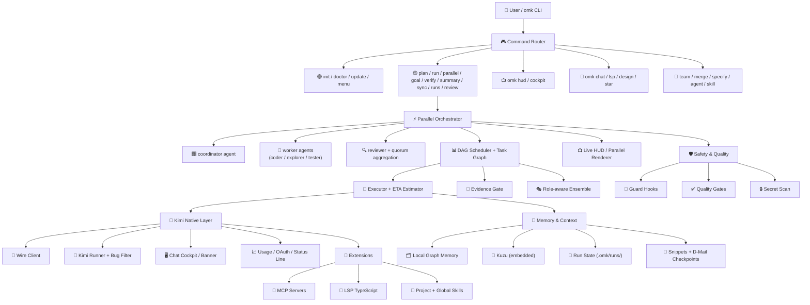

[](https://mseep.ai/app/dmae97-oh-my-kimi)

<div align="center">

<!-- Open Graph -->
<meta property="og:image" content="https://raw.githubusercontent.com/dmae97/oh-my-kimi/main/readmeasset/kimicat.png" />
<meta property="og:title" content="oh-my-kimi" />
<meta property="og:description" content="Kimi Code CLI, but orchestrated: OMK turns one prompt into a verified multi-agent workflow." />

<!-- Twitter -->
<meta name="twitter:card" content="summary_large_image" />
<meta name="twitter:image" content="https://raw.githubusercontent.com/dmae97/oh-my-kimi/main/readmeasset/kimicat.png" />


<p><sub>Preview GIF rebuilt from the new <code>readmeasset/kimicat.mp4</code> demo asset.</sub></p>

<h1>oh-my-kimi</h1>

<p>
  <strong>Kimi-native multi-agent orchestration harness for the Kimi Code CLI</strong><br/>
  <sub>Kimi-native orchestration with Open Design localhost, graph memory, DeepSeek advisory routing, verified MCP, release guards, and zero-config safety hooks.</sub>
</p>

<p>
  <strong>What is oh-my-kimi?</strong> oh-my-kimi (OMK) wraps the Kimi Code CLI (Kimi K2.6) with a multi-agent orchestration layer. It spins up parallel coding teams in isolated Git worktrees, enforces lint / typecheck / test / build gates before completion, and provides a real-time terminal HUD to monitor progress.
</p>

<p align="center">
  <code>npm install -g @oh-my-kimi/cli</code><br/>
  <code>omk init</code><br/>
  <code>omk doctor</code><br/>
  <code># omk demo  # Coming soon — try the examples below</code>
</p>

> ✅ <strong>Stable Release</strong> — v1.1.6 is ready for daily use. Open Design now connects through OMK CLI, MCP JSON-RPC failures are surfaced cleanly, generated hooks/skills are documented, and the release gate is fully verified.


<p>
  <a href="https://github.com/dmae97/oh-my-kimi/actions/workflows/ci.yml"></a>
  <a href="https://github.com/dmae97/oh-my-kimi/releases"></a>
  <a href="https://www.npmjs.com/package/@oh-my-kimi/cli"></a>
  <a href="https://www.npmjs.com/package/@oh-my-kimi/cli"></a>
  <a href="https://github.com/dmae97/oh-my-kimi/stargazers"></a>
  <a href="https://github.com/dmae97/oh-my-kimi/network/members"></a>
  <a href="https://github.com/dmae97/oh-my-kimi/issues"></a>
  <a href="./LICENSE"></a>
</p>

<p>
  
  
  
  
  
</p>

<p>
  <a href="#korean">Korean</a> /
  <a href="#english">English</a> /
  <a href="#chinese">Chinese</a> /
  <a href="#japanese">Japanese</a>
</p>

</div>

---

## Table of Contents

- [Quick Start](#quick-start)
- [Open Design localhost workflow](#open-design-localhost-workflow-omk--kimi)
- [OMK Ontology Graph](#omk-ontology-graph)
- [Examples](#examples)
- [GitHub Release Snapshot](#github-release-snapshot)
- [Repository Topics](#repository-topics)
- [One Prompt to Landing Page](#one-prompt-to-landing-page)
- [Korean](#korean)
- [English](#english)
- [Chinese](#chinese)
- [Japanese](#japanese)
- [Customization](#customization)
- [Acknowledgements](#acknowledgements)

---

## Quick Start

```bash
# 1. Install
npm install -g @oh-my-kimi/cli

# 2. Initialize a project
mkdir my-project && cd my-project
omk init

# 3. Verify your environment
omk doctor

# 4. Optional: enable DeepSeek hybrid routing
printf '%s' "$DEEPSEEK_API_KEY" | omk deepseek api
omk deepseek doctor --soft

# 5. Run a planned workflow
omk run "Build a Next.js landing page with dark mode and contact form"
```

## Open Design localhost workflow (OMK + Kimi)

Use this when you want OMK/Kimi to work through a local visual design surface instead of only a terminal prompt. OMK launches [nexu-io/Open Design](https://github.com/nexu-io/open-design) on localhost and registers an OMK CLI adapter, then you use the web UI to generate or iterate design artifacts with **OMK CLI** selected as the local agent.


### How it works

1. OMK clones or reuses Open Design under `.omk/open-design`.
2. OMK installs the Open Design pnpm workspace with Corepack.
3. OMK starts the local daemon and web app:
   - Web UI: `http://localhost:5175`
   - Daemon: `http://localhost:7457`
4. In the Open Design UI, select **OMK CLI** if it is not selected automatically. OMK injects a local bridge that avoids the old Kimi ACP smoke-test timeout.
5. Describe the screen, landing page, deck, or prototype you want. Use `DESIGN.md` as the visual source of truth.
6. Bring the output back to OMK for implementation/review with `/omk-flow-design-to-code`, `/omk-multimodal-ui-review`, or the normal quality gate.

> Korean quick note: “로컬호스트로 불러서 OMK가 붙는다”는 뜻은 OMK가 Open Design daemon/web을 로컬에서 띄우고, Open Design UI에서 OMK CLI를 선택해 디자인 산출물을 만들도록 연결한다는 의미입니다. 최종 코드화는 OMK의 DESIGN.md-aware 스킬과 품질 게이트가 이어받습니다.

### License note

Open Design is upstream [Apache-2.0](https://github.com/nexu-io/open-design/blob/main/LICENSE) licensed (`.omk/open-design/LICENSE` after launch). OMK remains [MIT](./LICENSE); the `omk design open-design` command launches a local upstream checkout and does not relicense Open Design. Keep the upstream Apache-2.0 license/notice intact when redistributing Open Design source or modifications.

### Commands

```bash
# Requirements for Open Design itself
node -v          # Open Design requires Node.js 24.x
corepack --version
git --version

# Preview the launch plan without cloning/installing/starting anything
omk design open-design --print-only

# First real launch: clone, install, start daemon + web, then open localhost
omk design open-design --open

# In Kimi chat, the slash skill does the same thing
/open-design
```

Useful options:

```bash
# Use different ports if 5175 / 7457 are busy
omk design open-design --web-port 5176 --daemon-port 7458 --open

# Reuse or update the checkout
omk design open-design --dir .omk/open-design --update --open

# Keep logs in the foreground while debugging startup
omk design open-design --foreground

# Check Open Design status/logs manually
cd .omk/open-design
corepack pnpm tools-dev status
corepack pnpm tools-dev check web
corepack pnpm tools-dev logs
corepack pnpm tools-dev stop web
```

On WSL, `--open` prefers `wslview` when installed and otherwise falls back to `cmd.exe /c start`, so the localhost URL opens in the Windows browser instead of failing through Linux `xdg-open`.

If an existing project does not have the slash skill yet, run:

```bash
omk skill sync
```

## OMK Ontology Graph

Use this when the project feels too large to reason about from file names alone. OMK renders its project-local memory into an interactive graph so you can see which files, risks, decisions, goals, and evidence are connected before asking Kimi to change code.


### What it shows

- **Nodes**: files, decisions, risks, goals, evidence, commands, and generated summaries.
- **Edges**: relationships such as `PART_OF`, `DEPENDS_ON`, `TOUCHES_FILE`, `EVIDENCED_BY`, and `RELATES_TO`.
- **Filters**: type or label filters for quickly narrowing a dense graph to the area Kimi should inspect.
- **Counts**: node/edge totals so you can tell whether the current memory snapshot is populated.

### Commands

```bash
# Build and open the interactive graph from .omk/memory/graph-state.json
omk graph view --open

# In Kimi chat, the slash skill triggers the same inspection workflow
/graph-view
```

> Korean quick note: 위 스크린샷처럼 “노드/엣지로 보는 OMK 기억 지도”를 띄운 뒤, Kimi에게 “이 리스크맵 기준으로 관련 파일만 고쳐줘”처럼 지시하면 불필요한 전체 레포 탐색을 줄일 수 있습니다.

## Examples

Case studies with reproducible prompts, actual outputs, and honest limitations.

**One-prompt landing page** — Next.js + Tailwind landing page from a single sentence  


| Example | Prompt → Output | Status |
|---|---|---|
| [One-prompt landing page](https://github.com/dmae97/oh-my-kimi/tree/main/examples/one-prompt-landing-page) | Next.js + Tailwind landing page from a single sentence | 🎬 Video available |
| [Neon Courier 2D](https://github.com/dmae97/oh-my-kimi/tree/main/examples/neon-courier-2d) | Browser 2D runner game in TypeScript | 🎬 Video available |
| [Neon Courier FPS](https://github.com/dmae97/oh-my-kimi/tree/main/examples/neon-courier-fps) | Three.js first-person prototype | 🎬 Video available |

Each example includes:
- **Prompt** — exactly what was sent
- **RUN_REPORT.md** — what the agents produced
- **Known limitations** — what broke or needed manual fix

---

## GitHub Release Snapshot

> **Current GitHub-ready version:** `1.1.6`

### What's New in v1.1.6

| **Area** | **GitHub-visible update** | **Why it matters** |
|----------|---------------------------|--------------------|
| **Open Design** | `omk design open-design` now patches the local Open Design checkout with an **OMK CLI** adapter, `OMK_BIN` setting, Kimicat icon, and root/deep-link route fix | Localhost design testing no longer hits the Kimi ACP 45 s smoke-test timeout; `/api/test/connection` returns `ok` through OMK in about 4 s |
| **CLI Bridge** | New `omk open-design-agent` connection point with fast smoke response and Kimi print-mode handoff for real prompts | Open Design has a stable local CLI endpoint that keeps OMK as the integration boundary |
| **MCP Reliability** | `omk mcp test` and `omk-project` return tool-level JSON-RPC errors instead of opaque `json-rpc id 3: Internal error` crashes | MCP debugging becomes actionable and safe for local/remote connection tests |
| **Generated Hooks** | `omk init` now ships session context, awesome-agent-skills advisory routing, precompact checkpointing, subagent completion audit, release guard, secret guard, formatter, and stop verification hooks | New projects start with stronger workflow routing and deploy-proof final reports |
| **Skill Surface** | OMK Core skill pack puts `open-design` first and includes graph-view plus DeepSeek controls | `/skills` exposes the most useful local design and graph workflows first |
| **DeepSeek Hybrid** | Goal progress and file-affecting nodes can use DeepSeek advisory while Kimi keeps write/merge authority | API keys are useful immediately without handing edits to the advisory model |
| **README Assets** | Refreshed Open Design localhost, hooks, skills, skill-pack, HUD, cockpit, and status-line screenshots under `readmeasset/` | GitHub/npm pages now show the current v1.1.6 product surface |
| **Automation** | `omk cron` — `list`, `run`, `logs`, `enable`, `disable` for scheduled DAG workflows, with validated job names and persisted run logs | Run repeatable DAG jobs without an external cron daemon |
| **Timeouts** | `--timeout-preset` for `omk run` / `omk parallel`, per-node `timeoutPreset`, and custom `[timeouts.<name>]` config | Keep quick tasks fast while allowing long-running agent work safely |
| **Safety & Quality** | `omk init` keeps global MCP secrets in user scope and preserves custom project `.kimi/mcp.json`; generated docs ignore is narrowed | Prevent accidental token leaks and avoid hiding authored documentation |
| **Memory** | Local graph memory remains default; embedded Kuzu is supported; stale Neo4j config no longer warns at startup | Cleaner ontology memory startup with no Neo4j credential noise |
| **Memory** | `omk graph view` renders `.omk/memory/graph-state.json` into an interactive HTML ontology graph, with `/graph-view` slash-command support | Inspect goals, decisions, risks, files, evidence, and derived relationships visually |
| **Chat Harness** | `omk chat` — Interactive Kimi session with orchestrated path, exit banner (Run ID, resume, workers, MCP, skills), and cockpit/tmux support | Turn Kimi CLI into a persistent, resumable chat session with full OMK context |
| **Chat Harness** | Chat-dedicated first-run star prompt (`OMK_STAR_PROMPT`) with cockpit-child deduplication | Polished onboarding without duplicate prompts in tmux splits |
| **Performance** | Parallel I/O optimization across `cockpit`, `doctor`, `hud`, `ensemble`, `dag`, `run`, and MCP server | Faster dashboard refresh and lower latency on every command |
| **UI/UX** | `omk cockpit` — Real-time compact dashboard with parallel TODO/agent rendering, git changes, and history | Monitor your multi-agent run from a tmux side panel |
| **UI/UX** | `omk hud` — Full terminal dashboard with goal scoring, ETA estimation, and state-error recovery hints | Understand run health at a glance and know the next action |
| **Safety & Quality** | Strict lint, typecheck, full `npm test`, smoke test, package audit, and secret scan gates | Production-grade reliability for daily use |
| **Orchestration** | DAG scheduler with retry, skip-on-failure, fallback roles, evidence gates, and ensemble candidates | Robust multi-agent execution with failure recovery |
| **DeepSeek Hybrid** | `omk deepseek api` stores the official API key locally, automatically enables hybrid routing, and uses deterministic Flash/Pro workers with Kimi as writer/merger | Add low-risk DeepSeek review/QA/advisory help without giving up Kimi authority |
| **Memory** | Local graph memory (default) and embedded Kuzu backends | Choose the right graph store for your project size |

### What's New in v0.4.0

| **Area** | **GitHub-visible update** | **Why it matters** |
|----------|---------------------------|--------------------|
| **Experimental** | `omk specify` — GitHub Spec Kit integration (init, workflow, preset, version) | Connect structured planning to Kimi-native DAG execution |
| **Core Engine** | `omk dag from-spec [dir]` — Convert spec Kit `tasks.md` into OMK DAG with dependency inference and role-based routing | Turn written specs into executable parallel pipelines |
| **Core Engine** | `omk parallel --from-spec <dir>` — Load spec-based DAG and execute via existing parallel executor | Reuse the same spec for planning and execution |
| **Core Engine** | `omk feature` / `bugfix` / `refactor` / `review` workflow presets with `--spec-kit` | One-command entry points for common development workflows |
| **UI/UX** | `omk summary` / `summary-show` — Generate `summary.md` + `report.md` for the latest run | Understand what happened after a long agent run |
| **UI/UX** | `omk index` / `index-show` — Build project index (package manager, git status, file tree) for context reduction | Faster agent context building without manual repo exploration |
| **Experimental** | `omk skill pack` / `install` / `sync` — Curated Kimi skill pack management | Share and version agent skills across projects |
| **Experimental** | `omk agent list` / `show` / `create` / `doctor` — Agent registry and YAML diagnostics | Manage 16 built-in roles and validate agent definitions |
| **Safety & Quality** | Default `approval_policy = "auto"`, `yolo_mode = false` | Safe-by-default for open-source users |
| **Safety & Quality** | `doctor` npm 10+ compatible; smoke test validates `doctor.errors` | First-install diagnostics work on modern Node/npm and catch real failures |

<details>
<summary>v0.3.0 release notes (click to expand)</summary>

| **Area** | **GitHub-visible update** | **Why it matters** |
|----------|---------------------------|--------------------|
| **Core Engine** | `omk parallel <goal>` (alpha) — coordinator → worker fan-out → reviewer with live ETA tracking | Spin up a multi-agent team from a single goal with real-time progress |
| **Core Engine** | Enhanced DAG engine with priority, cost, routing, `failurePolicy`, and evidence gates per node | DAG orchestration with retries, fallbacks, and I/O validation (alpha) |
| **Core Engine** | Role-aware ensemble — coder/planner/architect/reviewer/QA/explorer with weighted candidates + quorum aggregation | Improves agent-call quality while keeping `max_parallel = 1` by default |
| **Core Engine** | `omk run --run-id <id>` (alpha) resumes persisted run state | Long-running agent tasks survive restarts and context switches |
| **Core Engine** | `SendDMail` checkpoint helpers + `.omk/snippets/` reusable storage | Safer refactors and reusable code blocks across agent sessions |
| **UI/UX** | `omk hud` — live dashboard with System Usage, Kimi Usage gauges, Project Status, Latest Run, TODO & Changed Files sidebar | Real-time visibility into your agent fleet without external monitoring tools |
| **UI/UX** | Bare `omk` TTY entry point — HUD + interactive `@inquirer/prompts` menu | Zero-config entry point for new users; no more "what do I type first?" |
| **UI/UX** | `ParallelLiveRenderer` refreshes every 1.5 s with run state transitions | See workers start, finish, fail, and retry in real time |
| **UI/UX** | `OMK_KIMI_STATUS_GAUGES=1` enables visual bar gauges for 5 h/weekly quota | Know your Kimi API budget at a glance |
| **UI/UX** | `OMK_STAR_PROMPT` guided GitHub star experience on first CLI use | Community growth without being intrusive; respects `CI` and `--help` |
| **Memory & Intelligence** | Local graph memory — `.omk/memory/graph-state.json` with ontology mindmap and GraphQL-lite recall | Local-first memory works without external database setup |
| **Memory & Intelligence** | `omk lsp typescript` exposes the bundled TypeScript language server | Helps coding agents and editors share the same language intelligence |
| **Memory & Intelligence** | I18n utilities added for multi-language agent workflows | Foundation for localized agent prompts and CLI output |
| **Safety & Quality** | `stop-verify.sh` comprehensive verification + eslint + hardened path validation | Even in `yolo` mode, destructive commands and credential exposure are blocked |
| **Safety & Quality** | `runtime.resource_profile = "auto"` selects lite profile on 16 GB machines | Keeps OMK usable on 16 GB laptops and WSL environments |
| **Safety & Quality** | `npm run check`, `npm test`, `npm run lint`, `npm run build` wired into CI | GitHub contributors can verify changes before PRs |
| **Assets** | refreshed PNG screenshots: Open Design localhost, generated hooks, generated skills, skill packs, HUD, cockpit, and status-line gauges | Rich visual documentation for the GitHub landing page |

</details>

### GitHub Markdown checklist

- [x] GitHub Actions / package version / npm / stars / forks / issues badges are visible at the top.
- [x] Mermaid architecture diagrams render in GitHub-flavored Markdown.
- [x] Repository topic badges below match the recommended GitHub topics.
- [x] README logo PNG display width increased to `720 px` for a stronger GitHub landing page.
- [x] Screenshots for HUD, parallel UI, and status-line gauges are embedded with alt text.
- [x] I18n utilities and multi-language README sections are present.
- [x] Current PNG assets (`open-design-localhost.png`, `omk-v1.1.6-generated-hooks.png`, `omk-v1.1.6-generated-skills.png`, HUD, cockpit, and status-line captures) are included in the repo.

### README asset refresh (v1.1.6)

The README screenshots are regenerated from the current local package and Open Design localhost flow. They are intentionally static PNGs so GitHub and npm render them quickly.

<p align="center">
  
</p>
<p align="center">
  
</p>
<p align="center">
  
</p>

### Ontology Graph Viewer

See [OMK Ontology Graph](#omk-ontology-graph) for the interactive memory graph workflow and screenshot.

## Repository Topics

These topics are also mirrored in `package.json` keywords for npm/GitHub discoverability.

<p>
  
  
  
  
  
  
  
  
  
  
  
  
  
  
  
  
  
  
  
  
</p>

Recommended GitHub topics:

```txt
kimi, kimi-cli, kimi-code, kimi-k2, ai-agent, coding-agent, multi-agent, agentic-coding, orchestration, dag, task-graph, ensemble, mcp, model-context-protocol, lsp, typescript, nodejs, cli, developer-tools, worktree
```

---

## One Prompt to Landing Page

> `@oneprompt.mp4` prompt → COS landing page. 10–20 min. Kimi-native multi-agent CLI behind it.


---

<h2 id="korean">Korean</h2>

> ✅ <strong>Stable Release v1.1.6</strong> — Kimi Code CLI를 <strong>worktree 기반 코딩 팀</strong>으로 변환하세요. DESIGN.md 기반 UI 생성, AGENTS.md 호환성, 실시간 품질 게이트, 병렬 HUD를 제공합니다.

### Features

| Feature | Description |
|---------|-------------|
| Kimi K2.6 Optimized | Kimi K2.6에 특화된 워크플로우와 컨텍스트 관리 |
| DeepSeek Hybrid Routing | `omk deepseek api`로 공식 API 키를 저장하면 하이브리드 라우팅이 자동 enable 됩니다. DeepSeek Flash/Pro는 리뷰·QA·자문 역할을 맡고, 실제 작성/머지는 Kimi가 유지합니다. |
| Okabe + D-Mail | Kimi Code의 Okabe 스마트 컨텍스트 관리와 `SendDMail` 체크포인트 기본 활용 |
| Worktree-based Parallel Team | Git worktree로 에이전트별 격리된 작업 공간 제공 |
| DESIGN.md Integration | Google DESIGN.md 표준 기반 UI 생성 |
| Multi-Agent Compatible | AGENTS.md / GEMINI.md / CLAUDE.md 동시 지원 |
| Quality Gates | 완료 전 자동 lint, typecheck, test, build 검증 |
| Built-in LSP | `omk lsp typescript`로 번들 TypeScript language server 실행 |
| Parallel HUD | `omk hud` / `omk cockpit` — 병렬 에이전트 실행 실시간 모니터링 (System Usage, Kimi Usage, Project Status, Latest Run, TODO / Changed Files 사이드바) |
| MCP Integration | 다양한 MCP 서버와의 원활한 연동 |
| Local Graph Memory | 프로젝트/세션별 기억을 `.omk/memory/graph-state.json` 온톨로지 그래프로 저장하고 mindmap/GraphQL-lite 제공 |
| OAuth Usage Badge | Kimi `context:` 상태줄 옆에 masked 계정, 5h/weekly quota 표시; `OMK_KIMI_STATUS_GAUGES=1`로 시각적 게이지 활성화 |
| Approval Policy | 기본값은 `approval_policy = "auto"` (안전 모드); 필요시 `yolo`로 전환 가능 |
| Safety Hooks | yolo mode에서도 파괴적 명령어 및 비밀 유출 방지 기본 제공 |

### 🆕 v1.1.6 Highlights (Stable)

- **Open Design + OMK CLI** — `omk design open-design --open` registers OMK CLI locally and avoids the 45 s Kimi ACP smoke-test timeout
- **MCP JSON-RPC stability** — `json-rpc id 3: Internal error` paths now surface actionable tool-level errors
- **Hooks/Skills refreshed** — `/open-design`, `/graph-view`, awesome-agent-skills advisory routing, release guard, and stop verification are included in generated projects
- **README assets refreshed** — v1.1.6 package captures plus current localhost screenshots are committed under `readmeasset/`
- **`omk chat`** — 오케스트레이션 경로, 퇴장 배너(Run ID, 재개, workers, MCP, skills), cockpit/tmux 지원이 포함된 인터랙티브 Kimi 세션
- **Chat 전용 first-run star prompt** (`OMK_STAR_PROMPT`) — cockpit 자식 프로세스 중복 제거
- **성능** — `cockpit`, `doctor`, `hud`, `ensemble`, `dag`, `run`, MCP 서버 전반에 병렬 I/O 최적화 적용
- **`omk cockpit`** — 병렬 TODO/에이전트 렌더링, git 변경사항, 히스토리를 포함한 실시간 컴팩트 대시보드
- **`omk hud`** — 목표 점수, ETA 예측, 상태 오류 복구 힌트가 포함한 풀 터미널 대시보드
- **안전 및 품질** — 엄격한 lint, typecheck, 전체 `npm test`, smoke test, 패키지 감사, 시크릿 스캔 게이트 통과
- **오케스트레이션** — 재시도, 실패 시 건너뛰기, 폴백 역할, 증거 게이트, 앙상블 후보가 포함된 DAG 스케줄러
- **DeepSeek Hybrid** — 공식 API 키 입력 시 하이브리드 기능 자동 활성화; Flash/Pro 60/40 라우팅과 파일 변경 노드의 Pro 자문을 지원
- **메모리** — 로컬 그래프 메모리(기본값), 내장 Kuzu 백엔드

### 🆕 v0.4.0 Highlights

- **`omk specify`** — GitHub Spec Kit 연동 (init, workflow, preset, version)
- **`omk dag from-spec [spec-dir]`** — Spec Kit `tasks.md`를 OMK DAG JSON으로 변환 (의존성 추론 + 역할 기반 라우팅)
- **`omk parallel --from-spec <dir>`** — Spec 기반 DAG를 병렬 실행기로 실행
- **`omk feature` / `bugfix` / `refactor` / `review`** — `--spec-kit` 지원 워크플로우 프리셋
- **`omk summary`** / **`omk summary-show`** — 실행 요약 및 `report.md` 생성
- **`omk index`** / **`omk index-show`** — 프로젝트 인덱싱으로 컨텍스트 축소
- **`omk skill pack` / `install` / `sync`** — 큐레이트된 Kimi 스킬 팩 관리
- **`omk agent`** — 16개 내장 역할 등록소 및 YAML 진단
- **DAG evidence gates** — `command-pass` 등 증거 기반 게이트 지원
- **MCP doctor** — MCP 진단 및 JSON-RPC 핸드셰이크 테스트
- **안전 기본값** — `approval_policy = "auto"`, `yolo_mode = false`
- **npm 10+ 지원** — doctor의 npm global bin 탐지 개선
- **Smoke test 강화** — `doctor.errors` 검증으로 예기치 않은 실패 감지

### 🆕 v0.3.0 Highlights

- **`omk parallel <goal>` (alpha)** — coordinator → worker fan-out → reviewer 패턴으로 병렬 에이전트 팀 구성, 실시간 ETA 추적
- **`omk hud` 대시보드** — System Usage / Kimi Usage 게이지, Project Status, TODO & Changed Files 사이드바를 포함한 실시간 터미널 대시보드
- **TTY 인터랙티브 메뉴** — `omk` 단독 실행 시 HUD + `@inquirer/prompts` 메뉴 자동 실행
- **`--run-id` 실행 재개** — 이전 실행 상태를 `.omk/runs/`에서 복원하여 장기 작업도 안전하게 이어감
- **SendDMail 체크포인트 + Snippets** — 리팩토링 전 D-Mail 체크포인트 저장 및 `.omk/snippets/` 코드 블록 재사용
- **OAuth Usage Gauges** — `OMK_KIMI_STATUS_GAUGES=1`로 5시간/주간 할당량 시각적 게이지 활성화
- **16GB-friendly Runtime** — 메모리 자동 감지 후 lite 프로파일 전환, 저사양 노트북/WSL 지원
- **역할 기반 앙상블** — coder/planner/architect/reviewer/QA/explorer 가중 후보 + 쿼럼 집계
- **로컬 그래프 메모리** — `.omk/memory/graph-state.json` 온톨로지 그래프 + mindmap/GraphQL-lite
- **내장 LSP** — `omk lsp typescript`로 TypeScript language server 바로 실행
- **품질 게이트 강화** — `npm run check/test/lint/build`를 CI와 릴리스 체크에 연동
- **README 에셋** — Open Design localhost, 생성 hooks/skills, skill packs, HUD, 상태줄 게이지, 대시보드 최신화

### Install

```bash
npm install -g @oh-my-kimi/cli
```

> **Requirements:** Node.js >= 20, Git, python3, Kimi CLI (v1.39.0+)

### Quick Start

```bash
omk init
omk doctor
omk chat
```

### Kimi-native context

oh-my-kimi agents use an Okabe-compatible base agent that inherits `default` and adds `SendDMail`, so D-Mail is available for checkpoint rollback and context recovery. Use it before risky refactors, long-running handoffs, or `/compact`; durable facts still go to project-local ontology graph memory.

### Project-local graph memory

OMK stores project/session memory in `.omk/memory/graph-state.json` by default, decomposes notes into ontology nodes (`Goal`, `Decision`, `Task`, `Risk`, `Command`, `File`, `Evidence`, `Concept`), and exposes `omk_memory_mindmap` plus `omk_graph_query` for GraphQL-lite access. Embedded Kuzu remains available for Cypher-style graph queries.

The interactive wrapper also augments Kimi’s native `context:` status line with a masked OAuth account plus 5-hour and weekly usage/quota. See `docs/kimi-oauth-usage-status.md`.


### Preview

#### Live Cockpit (`omk hud`)


#### Live HUD (`omk hud`)


#### Kimi Status Line with Usage Gauges

OMK augments Kimi’s native `context:` status line with masked OAuth account + 5h/weekly quota. Set `OMK_KIMI_STATUS_GAUGES=1` for visual bar gauges.


```bash
$ omk doctor
OK Node.js           v22.14.0
OK Git               2.49.0
OK Python            3.13.2
OK tmux              3.5a
OK Kimi CLI          v1.39.0
OK Scaffold          .omk/, .kimi/skills/ found

$ omk parallel "refactor auth module"
Parallel Execution
Run ID:   2025-05-01T12-34-56
Goal:     refactor auth module
Workers:  3
✔ Parallel DAG run complete

$ omk team  # Experimental — tmux layout scaffold only
Team Runtime starting...
   [architect]  Creating plan.md...
   [coder]      Implementation in progress...
   [reviewer]   Code review done
   [qa]         Tests passed
```

### CLI Commands

> Note: run, parallel, verify, summary, sync, runs, and goal are alpha features. Expect breaking changes.

#### Stable

| Command | Description |
|---------|-------------|
| `omk init` | Scaffold .omk/, .kimi/skills/, .agents/skills/, docs, hooks, agents |
| `omk doctor` | Check Node, Kimi CLI, Git, python3, tmux, scaffold |
| `omk doctor --soft` | Soft mode: do not fail on missing tools — useful for smoke tests and CI |
| `omk chat` | Interactive Kimi with agent/config/MCP auto-detection |
| `omk plan <goal>` | Plan-only mode |
| `omk hud` | Live dashboard with system usage, Kimi quota, project status, run tracking |
| `omk lsp [server]` | Built-in LSP launcher; default server is TypeScript |
| `omk star` | GitHub star helper; manual retry and status check |
| `omk design init` | Create DESIGN.md with frontmatter |
| `omk design list` | List local/remote DESIGN.md files |
| `omk design apply <name>` | Convert DESIGN.md into code |
| `omk google stitch-install` | Install Google Stitch skills |
| `omk update` | Check or run OMK and Kimi CLI updates |
| `omk menu` | Interactive OMK main menu via @inquirer/prompts |

#### Alpha

| Command | Description |
|---------|-------------|
| `omk run <flow> <goal>` (alpha) | Flow-based task execution |
| `omk parallel <goal>` (alpha) | Parallel DAG execution (coordinator → workers → reviewer) |
| `omk review` (alpha) | Code review + security review of current changes |
| `omk review --ci` (alpha) | CI mode: local checks only, no Kimi API calls |
| `omk review --soft` (alpha) | Soft mode: always exit 0 even if review fails |
| `omk verify` (alpha) | Evidence gate verification for completed runs |
| `omk summary` (alpha) | Run summary and report generation |
| `omk sync` (alpha) | Sync Kimi assets (hooks, MCP, skills, local graph memory) |
| `omk sync --dry-run` (alpha) | Preview sync without applying changes |
| `omk sync --diff` (alpha) | Show diff of what would change |
| `omk sync --rollback` (alpha) | Rollback last sync from manifest |
| `omk runs` (alpha) | List past OMK runs with status and dates |
| `omk goal` (alpha) | Codex-style goal management |

#### Experimental

| Command | Status | Notes |
|---------|--------|-------|
| `omk team` | Layout only | tmux window layout scaffold |
| `omk agent` | Experimental | Agent registry and YAML diagnostics |
| `omk skill` | Experimental | Kimi skill pack manager |
| `omk merge` | Manual | Diff check + manual cherry-pick guidance |
| `omk design lint` | Stub | Validation not yet implemented |
| `omk design diff` | Stub | Diff not yet implemented |
| `omk design export` | Stub | Export not yet implemented |

#### Agent Registry

OMK ships with 16 built-in agent roles. Each role is a YAML file in `.omk/agents/roles/` that extends the Okabe-compatible base and defines `OMK_ROLE`, excluded tools, and specialized prompts.

**Stable** — recommended for production DAG nodes:

| Agent | Role | Best for |
|-------|------|----------|
| `planner` | Architecture / refactor planning | `omk plan`, `omk run` (alpha) plan-first flows |
| `coder` | Scoped implementation | Feature dev, bugfix, typed languages |
| `reviewer` | Adversarial code review | Pre-merge review, security audit |
| `qa` | Lint / typecheck / test / build | `omk-quality-gate` enforcement |
| `security` | Security review | Dependency audit, secret scan, RBAC |

**Experimental** — use with caution or for specialized tasks:

| Agent | Role | Best for |
|-------|------|----------|
| `coordinator` | Multi-agent coordination | `omk parallel` (alpha) fan-out orchestration |
| `architect` | System design | High-level module design |
| `explorer` | Repository discovery | Unfamiliar codebase mapping |
| `tester` | Test generation | Unit / integration test authoring |
| `docs` | Documentation | README, API docs, design docs |
| `merger` | Branch / PR merge | Conflict resolution, cherry-pick |
| `release` | Release flow | Version bump, changelog, tag |
| `integrator` | Cross-service integration | API glue, adapter code |
| `interviewer` | Interactive prompting | User requirement clarification |
| `researcher` | Deep research | Web search, doc reading, comparison |
| `vision-debugger` | UI / visual debugging | Screenshot analysis, CSS fixes |

### 🏗️ 아키텍처



### 🛡️ 안전

기본 훅은 파괴적 명령과 비밀 유출을 차단합니다:

- `.omk/config.toml`의 기본 approval policy는 `auto`이며, `yolo_mode = false`입니다.
- `session-context.sh` — 시작 시 Open Design, ontology graph, 배포 상태 확인 규칙 주입
- `awesome-agent-skills-router.sh` — 프롬프트를 OMK 스킬/워크플로로 advisory 라우팅
- `precompact-checkpoint.sh` — 컨텍스트 압축 전 목표/파일/검증/블로커 체크포인트 안내
- `subagent-stop-audit.sh` — 서브에이전트 종료 후 리더 검토/품질 게이트 요구
- `pre-shell-guard.sh` — `rm -rf /`, `sudo`, `git push --force`, 검증 없는 release/publish 등 차단
- `protect-secrets.sh` — `.env` 편집 및 비밀 유출 차단
- `post-format.sh` — 수정된 파일 자동 포맷
- `stop-verify.sh` — 종료 시 최종 검증/배포 과대보고 방지 체크리스트

### 🔌 내장 LSP

```bash
omk lsp --print-config
omk lsp --check
omk lsp typescript
```

`omk init`은 `.omk/lsp.json`을 생성하고, TypeScript/JavaScript 프로젝트에서 사용할 수 있는 번들 `typescript-language-server` 실행 경로를 제공합니다.

### 📄 라이선스

[MIT](./LICENSE)

Open Design 연동은 upstream [nexu-io/Open Design](https://github.com/nexu-io/open-design)을 사용하며, 해당 프로젝트는 Apache-2.0 라이선스입니다. OMK 본체는 계속 MIT 라이선스입니다.

---

<h2 id="english">English</h2>

> ✅ <strong>Stable Release v1.1.6</strong> — Turn Kimi Code CLI into a <strong>meme-tier multi-agent coding team</strong>. This is a Kimi-native wrapper — not a generic AI tool. DESIGN.md-aware UI, live quality gates, parallel HUD, AGENTS.md compatible.

### Features

| Feature | Description |
|---------|-------------|
| Kimi K2.6 Optimized | Workflows and context management tailored for Kimi K2.6 |
| DeepSeek Hybrid Routing | `omk deepseek api` stores the official API key and automatically enables hybrid routing. DeepSeek Flash/Pro handles review, QA, and advisory work while Kimi stays responsible for writing and merge authority. |
| Okabe + D-Mail | Uses Kimi Code Okabe smart context management and `SendDMail` checkpoint recovery by default |
| Worktree-based Parallel Team | Git worktree provides isolated workspaces per agent |
| DESIGN.md Integration | UI generation based on Google DESIGN.md standard |
| Multi-Agent Compatible | Simultaneous support for AGENTS.md / GEMINI.md / CLAUDE.md |
| Quality Gates | Automated lint, typecheck, test, build verification before completion |
| Parallel HUD | `omk hud` / `omk cockpit` — Real-time monitoring of parallel agent execution (System Usage, Kimi Usage gauges, Project Status, Latest Run, TODO / Changed Files sidebar) |
| MCP Integration | Seamless connection with various MCP servers |
| Local Graph Memory | Stores project/session memory in `.omk/memory/graph-state.json` as an ontology graph with mindmap/GraphQL-lite tools |
| Parallel DAG | `omk parallel <goal>` (alpha) runs coordinator → worker fan-out → reviewer with live UI and ETA tracking |
| Safety Hooks | Default protection against destructive commands and secret leakage |

### 🆕 v1.1.6 Highlights (Stable)

- **Open Design + OMK CLI** — `omk design open-design --open` registers OMK CLI locally and avoids the 45 s Kimi ACP smoke-test timeout
- **MCP JSON-RPC stability** — opaque internal errors now become actionable tool-level failures
- **Hooks/Skills refreshed** — generated projects include advisory routing, release guard, stop verification, `/open-design`, and `/graph-view`
- **README assets refreshed** — v1.1.6 package captures plus current localhost screenshots are committed under `readmeasset/`
- **`omk chat`** — Interactive Kimi session with orchestrated path, exit banner (Run ID, resume, workers, MCP, skills), and cockpit/tmux support
- **Chat-dedicated first-run star prompt** (`OMK_STAR_PROMPT`) with cockpit-child deduplication
- **Performance** — Parallel I/O optimization across `cockpit`, `doctor`, `hud`, `ensemble`, `dag`, `run`, and MCP server
- **`omk cockpit`** — Real-time compact dashboard with parallel TODO/agent rendering, git changes, and history
- **`omk hud`** — Full terminal dashboard with goal scoring, ETA estimation, and state-error recovery hints
- **Safety & Quality** — Strict lint, typecheck, full `npm test`, smoke test, package audit, and secret scan gates
- **Orchestration** — DAG scheduler with retry, skip-on-failure, fallback roles, evidence gates, and ensemble candidates
- **DeepSeek Hybrid** — Official API key setup automatically enables hybrid mode with deterministic Flash/Pro 60/40 routing and Pro advisory on file-affecting nodes
- **Memory** — Local graph memory (default) and embedded Kuzu backends

### 🆕 v0.4.0 Highlights

- **`omk specify`** — GitHub Spec Kit integration (init, workflow, preset, version)
- **`omk dag from-spec [spec-dir]`** — Convert spec Kit `tasks.md` into OMK DAG JSON with dependency inference and role-based routing
- **`omk parallel --from-spec <dir>`** — Load spec-based DAG and execute via existing parallel executor
- **`omk feature` / `bugfix` / `refactor` / `review`** — Workflow presets with `--spec-kit` support
- **`omk summary`** / **`omk summary-show`** — Generate `summary.md` + `report.md` for the latest run
- **`omk index`** / **`omk index-show`** — Build project index for context reduction
- **`omk skill pack` / `install` / `sync`** — Curated Kimi skill pack management
- **`omk agent`** — 16 built-in role registry and YAML diagnostics
- **DAG evidence gates** — `command-pass` and other evidence-based gate support
- **MCP doctor** — MCP diagnostics with executable checks and JSON-RPC handshake tests
- **Safe defaults** — `approval_policy = "auto"`, `yolo_mode = false`
- **npm 10+ support** — Improved npm global bin detection in doctor
- **Hardened smoke tests** — Validates `doctor.errors` to catch unexpected failures

### 🆕 v0.3.0 Highlights

- **`omk parallel <goal>` (alpha)** — Run coordinator → worker fan-out → reviewer with live ETA tracking and 1.5 s UI refresh
- **`omk hud` dashboard** — Real-time terminal dashboard with System / Kimi Usage gauges, Project Status, TODO & Changed Files sidebar
- **TTY interactive menu** — Bare `omk` launches HUD + `@inquirer/prompts` menu for zero-config onboarding
- **`--run-id` resume** — Restore any previous run from `.omk/runs/` persisted state
- **SendDMail checkpoints + Snippets** — Save D-Mail checkpoints before risky refactors and reuse code blocks via `.omk/snippets/`
- **OAuth Usage Gauges** — Visual bar gauges for 5 h/weekly quota via `OMK_KIMI_STATUS_GAUGES=1`
- **16 GB-friendly runtime** — Auto-detects memory and switches to lite profile for low-spec laptops / WSL
- **Role-aware ensemble** — Weighted candidate scoring + quorum aggregation across coder/planner/architect/reviewer/QA/explorer
- **Local graph memory** — Ontology graph in `.omk/memory/graph-state.json` with mindmap and GraphQL-lite recall
- **Built-in LSP** — `omk lsp typescript` bundles TypeScript language server out of the box
- **Quality gates wired to CI** — `npm run check / test / lint / build` enforced in CI and release checks
- **README assets** — Open Design localhost, generated hooks/skills, skill packs, HUD, status-line gauges, dashboard, and more

### Install

```bash
npm install -g @oh-my-kimi/cli
```

> **Requirements:** Node.js >= 20, Git, python3, Kimi CLI (v1.39.0+)

### Quick Start

```bash
omk init
omk doctor
omk chat
```

### Preview

#### Live HUD (`omk hud`)


#### Kimi Status Line with Usage Gauges

OMK augments Kimi’s native `context:` status line with masked OAuth account + 5h/weekly quota. Set `OMK_KIMI_STATUS_GAUGES=1` for visual bar gauges.


```bash
$ omk doctor
OK Node.js           v22.14.0
OK Git               2.49.0
OK Python            3.13.2
OK tmux              3.5a
OK Kimi CLI          v1.39.0
OK Scaffold          .omk/, .kimi/skills/ found

$ omk parallel "refactor auth module"
Parallel Execution
Run ID:   2025-05-01T12-34-56
Goal:     refactor auth module
Workers:  3
✔ Parallel DAG run complete

$ omk team
Team Runtime starting...
   [architect]  Creating plan.md...
   [coder]      Implementation in progress...
   [reviewer]   Code review done
   [qa]         Tests passed
```

### CLI Commands

> Note: run, parallel, verify, summary, sync, runs, and goal are alpha features. Expect breaking changes.

#### Stable

| Command | Description |
|---------|-------------|
| `omk init` | Scaffold .omk/, .kimi/skills/, .agents/skills/, docs, hooks, agents |
| `omk doctor` | Check Node, Kimi CLI, Git, python3, tmux, scaffold |
| `omk doctor --soft` | Soft mode: do not fail on missing tools — useful for smoke tests and CI |
| `omk chat` | Interactive Kimi with agent/config/MCP auto-detection |
| `omk plan <goal>` | Plan-only mode |
| `omk hud` | Live dashboard with system usage, Kimi quota, project status, run tracking |
| `omk lsp [server]` | Built-in LSP launcher; default server is TypeScript |
| `omk star` | GitHub star helper; manual retry and status check |
| `omk design init` | Create DESIGN.md with frontmatter |
| `omk design list` | List local/remote DESIGN.md files |
| `omk design apply <name>` | Convert DESIGN.md into code |
| `omk google stitch-install` | Install Google Stitch skills |

#### Alpha

| Command | Description |
|---------|-------------|
| `omk run <flow> <goal>` (alpha) | Flow-based task execution |
| `omk parallel <goal>` (alpha) | Parallel DAG execution (coordinator → workers → reviewer) |
| `omk review` (alpha) | Code review + security review of current changes |
| `omk review --ci` (alpha) | CI mode: local checks only, no Kimi API calls |
| `omk review --soft` (alpha) | Soft mode: always exit 0 even if review fails |
| `omk verify` (alpha) | Evidence gate verification for completed runs |
| `omk summary` (alpha) | Run summary and report generation |
| `omk sync` (alpha) | Sync Kimi assets (hooks, MCP, skills, local graph memory) |
| `omk sync --dry-run` (alpha) | Preview sync without applying changes |
| `omk sync --diff` (alpha) | Show diff of what would change |
| `omk sync --rollback` (alpha) | Rollback last sync from manifest |
| `omk runs` (alpha) | List past OMK runs with status and dates |
| `omk goal` (alpha) | Codex-style goal management |

#### Experimental

| Command | Status | Notes |
|---------|--------|-------|
| `omk team` | Layout only | tmux window layout scaffold |
| `omk agent` | Experimental | Agent registry and YAML diagnostics |
| `omk skill` | Experimental | Kimi skill pack manager |
| `omk merge` | Manual | Diff check + manual cherry-pick guidance |
| `omk design lint` | Stub | Validation not yet implemented |
| `omk design diff` | Stub | Diff not yet implemented |
| `omk design export` | Stub | Export not yet implemented |

### 🏗️ Architecture


### 🛡️ Safety

Default hooks block destructive commands and secret leakage:

- `session-context.sh` — Injects startup reminders for Open Design, ontology graph, and deployment claims
- `awesome-agent-skills-router.sh` — Advisory-routes prompts to installed OMK skills/workflows
- `precompact-checkpoint.sh` — Reminds agents to checkpoint goal, files, verification, and blockers before compaction
- `subagent-stop-audit.sh` — Requires leader review and quality gates after subagent completion
- `pre-shell-guard.sh` — Blocks `rm -rf /`, `sudo`, `git push --force`, unverified release/publish commands, etc.
- `protect-secrets.sh` — Blocks `.env` edits and secret leakage
- `post-format.sh` — Auto-formats modified files
- `stop-verify.sh` — Final verification checklist and anti-overclaim reminder on stop

### 📄 License

[MIT](./LICENSE)

Open Design integration uses [nexu-io/Open Design](https://github.com/nexu-io/open-design), which is licensed under Apache-2.0 upstream. OMK itself remains MIT licensed.

---

<h2 id="chinese">Chinese</h2>

> ✅ <strong>Stable Release v1.1.6</strong> — 将 Kimi Code CLI 转变为一个<strong>基于 worktree 的编码团队</strong>。支持 DESIGN.md 感知 UI 生成、AGENTS.md 兼容性、实时质量门禁以及并行 HUD。

### Features

| Feature | Description |
|---------|-------------|
| Kimi K2.6 优化 | 专为 Kimi K2.6 定制的工作流与上下文管理 |
| Okabe + D-Mail | 默认使用 Kimi Code Okabe 智能上下文管理和 `SendDMail` 检查点恢复 |
| 基于 Worktree 的并行团队 | Git worktree 为每个 Agent 提供隔离工作空间 |
| DESIGN.md 集成 | 基于 Google DESIGN.md 标准的 UI 生成 |
| 多 Agent 兼容 | 同时支持 AGENTS.md / GEMINI.md / CLAUDE.md |
| 质量门禁 | 完成前自动执行 lint、typecheck、test、build 验证 |
| 并行 HUD | `omk hud` / `omk cockpit` — 并行 Agent 执行实时监控（系统用量、Kimi 配额条、项目状态、最新运行、TODO / 变更文件侧边栏） |
| MCP 集成 | 与多种 MCP 服务器无缝连接 |
| Local Graph Memory | 将项目/会话记忆存入 `.omk/memory/graph-state.json` 本地本体图，并提供 mindmap/GraphQL-lite |
| 并行 DAG | `omk parallel <goal>` (alpha) 执行 coordinator → worker 扇出 → reviewer，带实时 UI 与 ETA 追踪 |
| 安全钩子 | 默认防止破坏性命令与密钥泄漏 |

### 🆕 v1.1.6 更新亮点 (Stable)

- **Open Design + OMK CLI** — localhost 设计桥接现在使用 OMK CLI，避免 45 秒 Kimi ACP smoke-test timeout
- **MCP JSON-RPC 稳定性** — internal error 会以可处理的 tool-level failure 呈现
- **Hooks/Skills 刷新** — 生成项目包含 release guard、stop verification、`/open-design`、`/graph-view`
- **README assets 刷新** — v1.1.6 package captures 已加入 `readmeasset/`
- **`omk chat`** — 带编排路径、退出横幅（Run ID、恢复、workers、MCP、skills）及 cockpit/tmux 支持的交互式 Kimi 会话
- **Chat 专用首次运行 star prompt** (`OMK_STAR_PROMPT`) — cockpit 子进程去重
- **性能** — 对 `cockpit`、`doctor`、`hud`、`ensemble`、`dag`、`run` 及 MCP 服务器进行并行 I/O 优化
- **`omk cockpit`** — 实时紧凑仪表盘，支持并行 TODO/Agent 渲染、git 变更与历史记录
- **`omk hud`** — 完整终端仪表盘，支持目标评分、ETA 估算与状态错误恢复提示
- **安全与质量** — 严格的 lint、typecheck、完整 `npm test`、smoke test、包审计、密钥扫描门禁
- **编排** — 支持重试、失败跳过、回退角色、证据门控与候选集成的 DAG 调度器
- **记忆** — 本地图记忆（默认）和嵌入式 Kuzu 后端

### 🆕 v0.4.0 更新亮点

- **`omk specify`** — GitHub Spec Kit 连动（init、workflow、preset、version）
- **`omk dag from-spec [spec-dir]`** — 将 Spec Kit `tasks.md` 转换为 OMK DAG JSON（依赖推断 + 角色路由）
- **`omk parallel --from-spec <dir>`** — 通过并行执行器加载并执行 Spec 驱动 DAG
- **`omk feature` / `bugfix` / `refactor` / `review`** — 支持 `--spec-kit` 的工作流预设
- **`omk summary`** / **`omk summary-show`** — 生成执行摘要及 `report.md`
- **`omk index`** / **`omk index-show`** — 项目索引构建，压缩上下文
- **`omk skill pack` / `install` / `sync`** — 精选 Kimi 技能包管理
- **`omk agent`** — 16 个内置角色注册表及 YAML 诊断
- **DAG evidence gates** — 支持 `command-pass` 等证据门控
- **MCP doctor** — MCP 诊断及 JSON-RPC 握手测试
- **安全默认值** — `approval_policy = "auto"`，`yolo_mode = false`
- **npm 10+ 支持** — 改进 doctor 的 npm global bin 探测
- **Smoke test 强化** — 验证 `doctor.errors` 以捕获意外失败

### 🆕 v0.3.0 更新亮点

- **`omk parallel <goal>` (alpha)** — 协调器 → 多 Worker 分发 → Reviewer 闭环，支持实时 ETA 追踪与 1.5 秒 UI 刷新
- **`omk hud` 仪表盘** — 实时终端仪表盘：系统/Kimi 资源 gauges、项目状态、TODO & 变更文件侧边栏
- **TTY 交互式入口** — 直接执行 `omk` 即可唤起 HUD + 交互式菜单，零配置上
- **`--run-id` 运行恢复** — 从 `.omk/runs/` 持久化状态恢复任意历史运行
- **SendDMail 检查点 + Snippets** — 危险重构前保存 D-Mail 检查点，通过 `.omk/snippets/` 复用代码块
- **OAuth 用量可视化** — `OMK_KIMI_STATUS_GAUGES=1` 实时展示 API 配额与重置倒计时
- **16GB 友好运行时** — 自动检测内存并切换轻量资源画像，低内存设备流畅运行
- **角色感知型编排** — 加权候选者 + 仲裁投票机制覆盖 coder/planner/architect/reviewer/QA/explorer
- **本地图记忆** — `.omk/memory/graph-state.json` 本体图谱，支持 mindmap / GraphQL-lite 查询
- **内置 LSP** — `omk lsp typescript` 开箱即用 TypeScript 语言服务
- **CI 质量门禁** — `npm run check/test/lint/build` 全链路接入 CI 与发布检查
- **新增 PNG 截图** — HUD、状态栏 gauges、仪表盘等 5 张界面截图补充

### Install

```bash
npm install -g @oh-my-kimi/cli
```

> **要求：** Node.js >= 20、Git、python3、Kimi CLI (v1.39.0+)

### Quick Start

```bash
omk init
omk doctor
omk chat
```

### Preview

#### Live HUD (`omk hud`)


#### Kimi Status Line with Usage Gauges

OMK augments Kimi’s native `context:` status line with masked OAuth account + 5h/weekly quota. Set `OMK_KIMI_STATUS_GAUGES=1` for visual bar gauges.


```bash
$ omk doctor
OK Node.js           v22.14.0
OK Git               2.49.0
OK Python            3.13.2
OK tmux              3.5a
OK Kimi CLI          v1.39.0
OK Scaffold          .omk/, .kimi/skills/ found

$ omk parallel "refactor auth module"
Parallel Execution
Run ID:   2025-05-01T12-34-56
Goal:     refactor auth module
Workers:  3
✔ Parallel DAG run complete

$ omk team  # Experimental — tmux layout scaffold only
Team Runtime 启动中...
   [architect]  创建 plan.md...
   [coder]      实现进行中...
   [reviewer]   代码审查完成
   [qa]         测试通过
```

### CLI Commands

> Note: run, parallel, verify, summary, sync, runs, and goal are alpha features. Expect breaking changes.

#### Stable

| Command | Description |
|---------|-------------|
| `omk init` | 创建 .omk/、.kimi/skills/、.agents/skills/、docs、hooks、agents 脚手架 |
| `omk doctor` | 检查 Node、Kimi CLI、Git、python3、tmux、脚手架 |
| `omk doctor --soft` | 软模式：缺少工具时不失败 — 适用于 smoke 测试和 CI |
| `omk chat` | 支持代理/配置/MCP 自动检测的交互式 Kimi |
| `omk plan <goal>` | 仅计划模式 |
| `omk hud` | 实时仪表盘：系统用量、Kimi 配额、项目状态、运行追踪 |
| `omk lsp [server]` | 内置 LSP 启动器；默认服务器为 TypeScript |
| `omk star` | GitHub star 助手；手动重试与状态检查 |
| `omk design init` | 创建带 frontmatter 的 DESIGN.md |
| `omk design list` | 列出本地/远程 DESIGN.md |
| `omk design apply <name>` | 将 DESIGN.md 转换为代码 |
| `omk google stitch-install` | 安装 Google Stitch 技能 |
| `omk update` | 检查或运行 OMK 和 Kimi CLI 更新 |
| `omk menu` | 通过 @inquirer/prompts 显示交互式 OMK 主菜单 |

#### Alpha

| Command | Description |
|---------|-------------|
| `omk run <flow> <goal>` (alpha) | 基于流程的任务执行 |
| `omk parallel <goal>` (alpha) | 并行 DAG 执行（coordinator → workers → reviewer） |
| `omk review` (alpha) | 当前变更的代码审查 + 安全审查 |
| `omk review --ci` (alpha) | CI 模式：仅本地检查，不调用 Kimi API |
| `omk review --soft` (alpha) | 软模式：审查失败也返回 exit 0 |
| `omk verify` (alpha) | 已完成运行的证据门验证 |
| `omk summary` (alpha) | 运行摘要与报告生成 |
| `omk sync` (alpha) | 同步 Kimi 资源（hooks、MCP、skills、本地图记忆） |
| `omk sync --dry-run` (alpha) | 预览变更，不实际应用 |
| `omk sync --diff` (alpha) | 显示将要变更的 diff |
| `omk sync --rollback` (alpha) | 从 manifest 回滚上次同步 |
| `omk runs` (alpha) | 列出过去的 OMK 运行及其状态和日期 |
| `omk goal` (alpha) | Codex 风格的目标管理 |

#### Experimental

| Command | Status | Notes |
|---------|--------|-------|
| `omk team` | 仅布局 | tmux 窗口布局脚手架 |
| `omk agent` | 实验性 | Agent 注册表及 YAML 诊断 |
| `omk skill` | 实验性 | Kimi 技能包管理器 |
| `omk merge` | 手动 | Diff 检查 + 手动 cherry-pick 指导 |
| `omk design lint` | 占位 | 验证尚未实现 |
| `omk design diff` | 占位 | Diff 尚未实现 |
| `omk design export` | 占位 | 导出尚未实现 |

### 🏗️ 架构


### 🛡️ 安全

默认钩子阻止破坏性命令和密钥泄漏：

- `session-context.sh` — 启动时注入 Open Design、ontology graph、部署声明检查提醒
- `awesome-agent-skills-router.sh` — 将提示词 advisory 路由到已安装的 OMK skills/workflows
- `precompact-checkpoint.sh` — 压缩上下文前提醒记录目标、文件、验证和阻塞项
- `subagent-stop-audit.sh` — 子代理结束后要求 leader 复核并运行质量门禁
- `pre-shell-guard.sh` — 阻止 `rm -rf /`、`sudo`、`git push --force`、未验证 release/publish 等
- `protect-secrets.sh` — 阻止 `.env` 编辑及密钥泄漏
- `post-format.sh` — 自动格式化修改的文件
- `stop-verify.sh` — 停止时的最终验证清单并防止夸大部署状态

### 📄 许可证

[MIT](./LICENSE)

Open Design 集成使用上游 [nexu-io/Open Design](https://github.com/nexu-io/open-design)，其许可证为 Apache-2.0；OMK 本身仍使用 MIT 许可证。

---

<h2 id="japanese">Japanese</h2>

> ✅ <strong>Stable Release v1.1.6</strong> — Kimi Code CLI を <strong>worktree ベースのコーディングチーム</strong>に変換します。DESIGN.md 対応の UI 生成、AGENTS.md 互換性、ライブ品質ゲート、並列 HUD を提供します。

### Features

| Feature | Description |
|---------|-------------|
| Kimi K2.6 対応 | Kimi K2.6 に特化したワークフローとコンテキスト管理 |
| Okabe + D-Mail | Kimi Code Okabe のスマートコンテキスト管理と `SendDMail` チェックポイント復旧を標準利用 |
| Worktree ベース並列チーム | Git worktree でエージェントごとに分離された作業空間を提供 |
| DESIGN.md 連携 | Google DESIGN.md 標準に基づく UI 生成 |
| マルチエージェント互換 | AGENTS.md / GEMINI.md / CLAUDE.md を同時サポート |
| 品質ゲート | 完了前に自動 lint、typecheck、test、build を検証 |
| 並列 HUD | `omk hud` / `omk cockpit` — 並列エージェント実行のリアルタイム監視（システム使用量、Kimi クォータゲージ、プロジェクト状態、最新実行、TODO/変更ファイルサイドバー） |
| MCP 統合 | 様々な MCP サーバーとのシームレスな連携 |
| Local Graph Memory | プロジェクト/セッション記憶を `.omk/memory/graph-state.json` のローカル ontology graph に保存し、mindmap/GraphQL-lite を提供 |
| 並列 DAG | `omk parallel <goal>` (alpha) は coordinator → worker ファンアウト → reviewer を実行。ライブ UI と ETA 追跡付き |
| 安全フック | 破壊的コマンドとシークレット漏洩をデフォルトで防止 |

### 🆕 v1.1.6 の主な更新 (Stable)

- **Open Design + OMK CLI** — localhost デザインブリッジが OMK CLI を使用し、45 秒の Kimi ACP smoke-test timeout を回避
- **MCP JSON-RPC stability** — internal error を actionable な tool-level failure として表示
- **Hooks/Skills refreshed** — release guard、stop verification、`/open-design`、`/graph-view` を生成プロジェクトに同梱
- **README assets refreshed** — v1.1.6 package captures を `readmeasset/` に追加
- **`omk chat`** — オーケストレーションパス、退出バナー（Run ID、再開、workers、MCP、skills）、cockpit/tmux 対応のインタラクティブ Kimi セッション
- **Chat 専用 first-run star prompt** (`OMK_STAR_PROMPT`) — cockpit 子プロセスの重複排除
- **パフォーマンス** — `cockpit`、`doctor`、`hud`、`ensemble`、`dag`、`run`、MCP サーバー全体に並列 I/O 最適化を適用
- **`omk cockpit`** — 並列 TODO/エージェントレンダリング、git 変更履歴、ヒストリーを含むリアルタイムコンパクトダッシュボード
- **`omk hud`** — 目標スコアリング、ETA 推定、状態エラー回復ヒントを含むフルターミナルダッシュボード
- **安全性と品質** — 厳格な lint、typecheck、完全な `npm test`、smoke test、パッケージ監査、シークレットスキャンのゲート
- **オーケストレーション** — リトライ、失敗時スキップ、フォールバックロール、エビデンスゲート、アンサンブル候補を備えた DAG スケジューラ
- **メモリ** — ローカルグラフメモリ（デフォルト）と組み込み Kuzu バックエンド

### 🆕 v0.4.0 の主な更新

- **`omk specify`** — GitHub Spec Kit 連携（init、workflow、preset、version）
- **`omk dag from-spec [spec-dir]`** — Spec Kit `tasks.md` を OMK DAG JSON に変換（依存推論 + ロールルーティング）
- **`omk parallel --from-spec <dir>`** — Spec ベース DAG を並列実行エンジンで実行
- **`omk feature` / `bugfix` / `refactor` / `review`** — `--spec-kit` 対応ワークフロープリセット
- **`omk summary`** / **`omk summary-show`** — 実行サマリーと `report.md` の生成
- **`omk index`** / **`omk index-show`** — プロジェクトインデックス構築でコンテキスト削減
- **`omk skill pack` / `install` / `sync`** — 厳選された Kimi スキルパック管理
- **`omk agent`** — 16 種類のビルトインロールレジストリと YAML 診断
- **DAG evidence gates** — `command-pass` などエビデンスベースゲート対応
- **MCP doctor** — MCP 診断と JSON-RPC ハンドシェイクテスト
- **安全なデフォルト** — `approval_policy = "auto"`、`yolo_mode = false`
- **npm 10+ 対応** — doctor の npm global bin 検出を改善
- **Smoke test 強化** — `doctor.errors` の検証で予期しない失敗を検知

### 🆕 v0.3.0 の主な更新

- **`omk parallel <goal>` (alpha)** — コーディネーター → Worker 分散 → Reviewer 集約。リアルタイム ETA 追跡と 1.5 秒間隔の UI 更新
- **`omk hud` ダッシュボード** — システム／Kimi のメーター、プロジェクト状態、TODO & 変更ファイルサイドバーを含むリアルタイムターミナルダッシュボード
- **TTY インタラクティブメニュー** — `omk` 単体実行で HUD + 対話型プロンプトを自動起動。設定不要ですぐに使える
- **`--run-id` 実行再開** — `.omk/runs/` の永続化状態から任意の過去実行を再開
- **SendDMail チェックポイント + Snippets** — 危険なリファクタ前に D-Mail チェックポイントを保存し、`.omk/snippets/` でコードブロックを再利用
- **OAuth 使用量ゲージ** — `OMK_KIMI_STATUS_GAUGES=1` で API クォータとリセット残時間をステータスバーにリアルタイム表示
- **16GB メモリ対応ランタイム** — 搭載メモリを自動検出し軽量プロファイルに切り替え。低スペック環境でも快適に動作
- **役割認識型アンサンブル** — 重み付き候補＋クォーラム投票を coder/planner/architect/reviewer/QA/explorer で実現
- **ローカルグラフメモリ** — `.omk/memory/graph-state.json` オントロジーで知識を構造化。mindmap / GraphQL-lite 対応
- **組み込み LSP** — `omk lsp typescript` で TypeScript 言語サーバーを即座に利用可能
- **CI 品質ゲート** — `npm run check/test/lint/build` を CI とリリースチェックに統合
- **新規スクリーンショット** — HUD、ステータスバー gauges、ダッシュボードなど 5 点の UI スクリーンショットを追加

### Install

```bash
npm install -g @oh-my-kimi/cli
```

> **要件:** Node.js >= 20、Git、python3、Kimi CLI (v1.39.0+)

### Quick Start

```bash
omk init
omk doctor
omk chat
```

### Preview

#### Live HUD (`omk hud`)


#### Kimi Status Line with Usage Gauges

OMK augments Kimi’s native `context:` status line with masked OAuth account + 5h/weekly quota. Set `OMK_KIMI_STATUS_GAUGES=1` for visual bar gauges.


```bash
$ omk doctor
OK Node.js           v22.14.0
OK Git               2.49.0
OK Python            3.13.2
OK tmux              3.5a
OK Kimi CLI          v1.39.0
OK Scaffold          .omk/, .kimi/skills/ found

$ omk parallel "refactor auth module"
Parallel Execution
Run ID:   2025-05-01T12-34-56
Goal:     refactor auth module
Workers:  3
✔ Parallel DAG run complete

$ omk team  # Experimental — tmux layout scaffold only
Team Runtime 開始中...
   [architect]  plan.md 作成中...
   [coder]      実装進行中...
   [reviewer]   コードレビュー完了
   [qa]         テスト通過
```

### CLI Commands

> Note: run, parallel, verify, summary, sync, runs, and goal are alpha features. Expect breaking changes.

#### Stable

| Command | Description |
|---------|-------------|
| `omk init` | .omk/、.kimi/skills/、.agents/skills/、docs、hooks、agents のスキャフォールドを作成 |
| `omk doctor` | Node、Kimi CLI、Git、python3、tmux、スキャフォールドを診断 |
| `omk doctor --soft` | ソフトモード：不足ツールでも失敗しない — smoke テストや CI に適しています |
| `omk chat` | エージェント/設定/MCP 自動検出対応の対話型 Kimi |
| `omk plan <goal>` | 計画専用モード |
| `omk hud` | リアルタイムダッシュボード：システム使用量、Kimi クォータ、プロジェクト状態、実行追跡 |
| `omk lsp [server]` | 組み込み LSP ランチャー；デフォルトサーバーは TypeScript |
| `omk star` | GitHub star ヘルパー；手動再試行と状態確認 |
| `omk design init` | frontmatter 付き DESIGN.md を作成 |
| `omk design list` | ローカル/リモート DESIGN.md を一覧表示 |
| `omk design apply <name>` | DESIGN.md をコードに変換適用 |
| `omk google stitch-install` | Google Stitch スキルをインストール |
| `omk update` | OMK と Kimi CLI の更新を確認または実行 |
| `omk menu` | @inquirer/prompts 経由でインタラクティブ OMK メニューを表示 |

#### Alpha

| Command | Description |
|---------|-------------|
| `omk run <flow> <goal>` (alpha) | フローベースのタスク実行 |
| `omk parallel <goal>` (alpha) | 並列 DAG 実行（coordinator → workers → reviewer） |
| `omk review` (alpha) | 現在の変更のコードレビュー + セキュリティレビュー |
| `omk review --ci` (alpha) | CI モード：ローカル検証のみ、Kimi API 呼び出しなし |
| `omk review --soft` (alpha) | ソフトモード：レビュー失敗時も exit 0 を維持 |
| `omk verify` (alpha) | 完了済み実行のエビデンスゲート検証 |
| `omk summary` (alpha) | 実行サマリーとレポート生成 |
| `omk sync` (alpha) | Kimi アセットを同期（hooks、MCP、skills、ローカルグラフメモリ） |
| `omk sync --dry-run` (alpha) | 変更を適用せずプレビュー |
| `omk sync --diff` (alpha) | 変更内容の diff を表示 |
| `omk sync --rollback` (alpha) | manifest から前回の同期をロールバック |
| `omk runs` (alpha) | 過去の OMK 実行を状態と日付で一覧表示 |
| `omk goal` (alpha) | Codex スタイルのゴール管理 |

#### Experimental

| Command | Status | Notes |
|---------|--------|-------|
| `omk team` | レイアウトのみ | tmux ウィンドウ レイアウト スキャフォールド |
| `omk agent` | 実験的 | エージェントレジストリと YAML 診断 |
| `omk skill` | 実験的 | Kimi スキルパックマネージャー |
| `omk merge` | 手動 | Diff 確認 + 手動 cherry-pick ガイダンス |
| `omk design lint` | スタブ | 検証は未実装 |
| `omk design diff` | スタブ | Diff は未実装 |
| `omk design export` | スタブ | エクスポートは未実装 |

### 🏗️ アーキテクチャ


### 🛡️ セーフティ

デフォルトのフックは破壊的コマンドとシークレットの漏洩をブロックします：

- `session-context.sh` — 起動時に Open Design、ontology graph、デプロイ状態確認の注意を注入
- `awesome-agent-skills-router.sh` — プロンプトをインストール済み OMK skills/workflows へ advisory ルーティング
- `precompact-checkpoint.sh` — コンテキスト圧縮前に目標、ファイル、検証、ブロッカーの記録を促す
- `subagent-stop-audit.sh` — サブエージェント終了後の leader レビューと品質ゲートを要求
- `pre-shell-guard.sh` — `rm -rf /`、`sudo`、`git push --force`、未検証の release/publish などをブロック
- `protect-secrets.sh` — `.env` の編集とシークレットの漏洩をブロック
- `post-format.sh` — 変更ファイルの自動フォーマット
- `stop-verify.sh` — 停止時の最終検証チェックリストと過大報告防止

### 📄 ライセンス

[MIT](./LICENSE)

Open Design 連携は upstream の [nexu-io/Open Design](https://github.com/nexu-io/open-design) を使用し、同プロジェクトは Apache-2.0 ライセンスです。OMK 本体は引き続き MIT ライセンスです。

---

<h2 id="customization">Customization</h2>

### ⭐ First-run GitHub Star Prompt

After your first successful interactive OMK CLI command (`init`, `doctor`, `hud`, `plan`, `parallel` (alpha), `run` (alpha)), OMK may ask: **"Support oh-my-kimi on GitHub?"**

- Only appears in **interactive TTY sessions**; never in CI, non-TTY, `chat`, `lsp`, `--help`, or `--version`.
- **Yes** → explicitly requests a star via authenticated `gh` CLI.
- **No** → records preference and never asks again.
- **Disable entirely:** `OMK_STAR_PROMPT=0`.
- **Manual retry:** `omk star`. Check state: `omk star --status`.
- No GitHub tokens are stored. Browser automation is not used.

### 📊 Command Maturity

OMK uses a three-tier maturity model defined in [`MATURITY.md`](./MATURITY.md):

- **Stable** — `init`, `doctor`, `chat`, `hud`, `lsp`
- **Alpha** — `parallel`, `run`, `review --ci`, `summary`, `verify`, `goal`, `sync`
- **Experimental** — `team`, `merge`, `specify`, `dag from-spec`, `skill`, `agent`, workflow presets (`feature` / `bugfix` / `refactor`)

`--json` output is supported on `doctor` and `verify` (alpha) for CI consumption.

### 🎨 Custom Welcome Banner Image

You can override Kimi CLI's default ASCII banner with your own image:

1. Place your image in the project root (e.g. `kimichan.png`).
2. Add to `.omk/config.toml`:

```toml
[theme]
logo_image = "kimichan.png"
```

- Supports **PNG**, **JPEG**, and **GIF**.
- Relative paths are resolved from the project root; absolute paths (including Windows `C:\...` or `M:\...`) work too.
- In **iTerm**, **Kitty**, **WezTerm**, and other graphics-capable terminals, the image renders in full resolution.
- In standard terminals, it falls back to high-quality ANSI block art via `terminal-image`.
- If the image is missing or rendering fails, the built-in ASCII art is used automatically.

---

<h2 id="acknowledgements">Acknowledgements</h2>

This project stands on the shoulders of giants. Every line of code here is possible because of the relentless dedication of open-source contributors around the world. With deepest respect and gratitude:

### Core Platform & AI
- **[Kimi Code CLI](https://github.com/moonshot-ai/kimi-cli)** by Moonshot AI — The foundation that makes everything possible. Without Kimi K2.6 and its brilliant native agent runtime, `oh-my-kimi` would not exist. Thank you for pushing the boundary of AI-native coding.
- **[Google DESIGN.md](https://design.md)** — For establishing a design-specification standard that bridges the gap between design intent and generated UI. A north star for structured frontend workflows.

### Language & Runtime
- **[TypeScript](https://www.typescriptlang.org/)** by Microsoft — For bringing sanity, safety, and stellar IDE experience to JavaScript at scale. The type system is the unsung hero of every refactor in this codebase.
- **[Node.js](https://nodejs.org/)** by the OpenJS Foundation — For the runtime that powers CLI tools, async I/O, and the entire npm ecosystem. Still the most versatile server-side JavaScript runtime on the planet.

### CLI & Developer Experience
- **[Commander.js](https://github.com/tj/commander.js)** by TJ Holowaychuk and contributors — The gold standard for building elegant, self-documenting command-line interfaces in Node.js.
- **[@inquirer/prompts](https://github.com/SBoudrias/Inquirer.js)** by Simon Boudrias — For beautiful, accessible, and keyboard-friendly interactive prompts. The TTY menu experience in `omk` is built on this.
- **[execa](https://github.com/sindresorhus/execa)** by Sindre Sorhus — For making child-process execution predictable, promise-friendly, and cross-platform. Every shell-out in OMK goes through this.
- **[tsx](https://github.com/privatenumber/tsx)** by Anthony Fu — For zero-config TypeScript execution during development. `npm run dev` simply works, and that magic matters.

### Data Validation & Parsing
- **[Zod](https://zod.dev/)** by Colin McDonnell — For TypeScript-first schema validation that feels like part of the language. Runtime safety without sacrificing developer ergonomics.
- **[yaml](https://github.com/eemeli/yaml)** by Eemeli Aro — For robust YAML parsing and stringifying. Agent configs, memory files, and CI definitions all rely on this.

### Filesystem & Terminal
- **[fs-extra](https://github.com/jprichardson/node-fs-extra)** by JP Richardson — For the filesystem utilities Node.js should have had from day one. Copy, move, ensureDir — all battle-tested.
- **[terminal-image](https://github.com/sindresorhus/terminal-image)** by Sindre Sorhus — For rendering images inside terminal emulators. The custom banner feature in OMK owes its magic to this.
- **[node-pty](https://github.com/microsoft/node-pty)** by Microsoft — For pseudo-terminal bindings that make interactive shell sessions feel native inside Node.js.
- **[tmux](https://github.com/tmux/tmux)** by Nicholas Marriott and contributors — The timeless terminal multiplexer. Team-runtime window layouts and long-lived agent sessions wouldn't be the same without it.

### Language Server & Graph Database
- **[typescript-language-server](https://github.com/typescript-language-server/typescript-language-server)** by TypeFox — For bundling a standards-compliant LSP that gives coding agents the same intelligence as VS Code.

### Version Control & Collaboration
- **[Git](https://git-scm.com/)** by Linus Torvalds and the Git community — For the distributed version control system that enables worktrees, branches, and every merge strategy in OMK.
- **[GitHub](https://github.com/)** — For the platform that hosts this project, runs our CI, and connects maintainers with contributors across the globe.

### Inspiration & Community
- **[OpenCode](https://github.com/opencode)** and the broader agentic-coding community — For proving that AI-native development workflows are not just possible, but inevitable. Your early experiments with autonomous coding agents lit the path.
- **Creators of `oh-my-opencode`, `oh-my-claude`, and `oh-my-codex`** — For showing that every major AI coding assistant deserves its own ergonomic harness. Your pioneering work inspired the architecture and philosophy behind `oh-my-kimi`.
- **The Kimi engineering team at Moonshot AI** — For building not just a model, but a complete native agent runtime with Okabe context management, D-Mail checkpoints, SendDMail recovery, and subagent orchestration. You redefined what a coding assistant can be.

---

> *"오픈소스는 코드가 아니라 사람들의 연대입니다. — Open source is not code; it is solidarity among people."*

<div align="center">
  <sub>Built with love for the Kimi ecosystem. 🙇 Respect to every maintainer, contributor, and issue reporter who makes open source possible.</sub>
</div>
