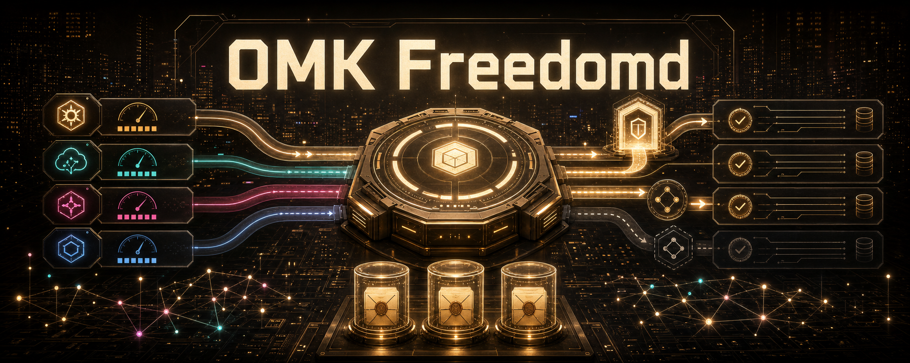

# OMK — Freedomd agent control plane

**Local-first, multi-provider, evidence-based orchestration for coding agents.**

OMK turns a coding goal into a scoped DAG run, routes it across compatible runtimes, limits authority per lane, records local evidence, and keeps the loop moving even when a provider is unavailable, retained, export-restricted, or policy-blocked.



<p>
  <a href="https://www.npmjs.com/package/open-multi-agent-kit"></a>
  <a href="LICENSE"></a>
  <a href="https://github.com/dmae97/open-multi-agent-kit/blob/main/proof/PROOF_INDEX.md"></a>
  <a href="https://github.com/dmae97/open-multi-agent-kit/discussions"></a>
</p>

## What changed in v0.80.1

OMK now has a **Freedomd** control-plane direction:

- **Provider sovereignty scoring** — route by health, authority, capability, retention, jurisdiction, cutoff risk, locality, and portability.
- **Retention gate** — classify task data and decide `allow`, `redact`, `downgrade`, or `block` before a prompt leaves the local control plane.
- **Cutoff-resilient routing** — provider incidents and policy blocks degrade to local authority, read-only review, artifact replay, or a clear diagnostic instead of silently stalling.
- **Local-first evidence envelopes** — persist provider-independent evidence under `.omk/runs/<run-id>/freedomd/` with hashes for replay and audit.
- **Default agent freedom** — high-autonomy agent behavior is default; strict guardrails are opt-in with `OMK_STRICT_GUARDRAIL=1`.
- **Explicit Freedomd mode** — sovereignty routing is opt-in with `OMK_FREEDOMD_MODE=balanced` or `OMK_FREEDOMD_MODE=strict`.

## 30-second demo

```bash
npx -y -p open-multi-agent-kit omk do "review this repo for release risk" --dry-run --json
```

A dry run produces bounded planning artifacts before changing files:

```txt
goal
  review this repo for release risk

flow
  goal -> input envelope -> DAG -> scoped lanes -> evidence -> verify

artifacts
  .omk/runs/<run-id>/input-envelope.json
  .omk/runs/<run-id>/dag.json
  .omk/runs/<run-id>/dag-compile-report.json
```

Executing a run adds loop state, route decisions, evidence observations, and replayable artifacts under `.omk/runs/<run-id>/`.

## Install

```bash
npm install -g open-multi-agent-kit
omk init
omk doctor
omk chat
```

Local checkout verification:

```bash
npm ci
npm run build
node dist/cli.js do "explain this repo" --dry-run --json
npm run verify:no-kimi
```

## Configure Freedomd

Balanced mode prefers provider diversity and records sovereignty diagnostics:

```bash
OMK_FREEDOMD_MODE=balanced omk chat
```

Strict mode prefers local/self-hosted paths and blocks retained/export-restricted providers more aggressively:

```bash
OMK_FREEDOMD_MODE=strict OMK_MAX_RETENTION_DAYS=0 omk chat
```

Provider incident overrides are local and auditable:

```json
{
  "schemaVersion": "omk.provider-incidents.v1",
  "incidents": [
    {
      "providerId": "anthropic",
      "kind": "export-control",
      "severity": "block",
      "reason": "operator policy override",
      "updatedAt": "2026-06-16T00:00:00.000Z"
    }
  ]
}
```

Save that as `.omk/provider-incidents.json`, or set `OMK_PROVIDER_INCIDENTS` to the same JSON. Optional public feeds can be supplied with `OMK_FREEDOMD_FEED_URLS`; feed failures never block routing and local overrides win.

## Use OMK if you

- use Codex, OpenCode, CommandCode, Kimi, DeepSeek, GLM, Qwen, OpenRouter, MiMo, or local models in the same repo;
- want provider availability, retention, jurisdiction, and exportability treated as runtime risks;
- need read/write/shell/merge authority separated by task;
- want agents to produce replayable evidence before saying “done”;
- need project-scoped MCP, skills, hooks, and graph memory instead of ambient global tool access;
- need degraded local/review/replay modes when frontier providers are blocked.

## What OMK controls

```text
Goal -> DAG -> lane grants -> runtime routing -> evidence envelope -> verify -> replay
```

- **Routing**: choose compatible provider/runtime lanes with capability and sovereignty scores.
- **Authority**: keep read, write, patch, shell, MCP, and merge power explicit.
- **Evidence**: require command output, diff, artifact, metric, or review proof.
- **Replay**: save run artifacts under `.omk/runs/<run-id>/` for audit.
- **Fallback**: degrade to local/review/replay modes when policy or provider health blocks execution.
- **Scope**: keep MCP servers, skills, hooks, and memory bounded per lane.

## How OMK differs

| Surface | Common failure | OMK adds |
| --- | --- | --- |
| Single-agent coding CLIs | Strong execution but weak audit | DAG, lane grants, local evidence, replay |
| Cloud frontier providers | Policy/retention/export cutoff risk | Freedomd sovereignty scoring and degraded fallback |
| MCP servers | Ambient tool access | Per-lane MCP/tool/shell authority |
| CI | Post-hoc verification | Agent-time evidence gates before completion |
| Local LLMs | Lower capability but high sovereignty | Local-first fallback and review/replay modes |

## Release and safety claims

Current source version: `open-multi-agent-kit@0.80.1`.

- Runtime contract family: `v1.2`.
- Release channel: `pre-1.0`.
- OS-level sandboxing is **not** claimed; safety relies on authority gates, approval/sandbox policy, scoped capabilities, evidence, and local artifacts.
- npm `latest` claims are valid only after tagged CI and registry verification both pass.
- README hero generation used the local Codex OAuth `gpt-image-2` workflow; the official `omk image` OpenAI Images API path still requires an OpenAI Platform project API key supplied only at runtime.

See [versioning](docs/versioning.md), [claims](docs/claims.md), [provider maturity](docs/provider-maturity.md), and [SECURITY.md](SECURITY.md).

## Examples

- [Codex MCP evidence run](https://github.com/dmae97/open-multi-agent-kit/tree/main/examples/codex-mcp-evidence-run): project-scoped MCP setup plus evidence-gated DAG dry run.
- [Provider fallback](https://github.com/dmae97/open-multi-agent-kit/tree/main/examples/provider-fallback): `--provider auto` routing with fallback planning.
- [Proof index](https://github.com/dmae97/open-multi-agent-kit/blob/main/proof/PROOF_INDEX.md): source-controlled proof bundles checked by `npm run proof:check`.

## Community

- Ask setup and provider questions in [Discussions](https://github.com/dmae97/open-multi-agent-kit/discussions).
- File reproducible bugs in [Issues](https://github.com/dmae97/open-multi-agent-kit/issues).
- Star the repo to follow the `0.80.x` pre-1.0 Freedomd release line.

## License

[MIT](LICENSE)
