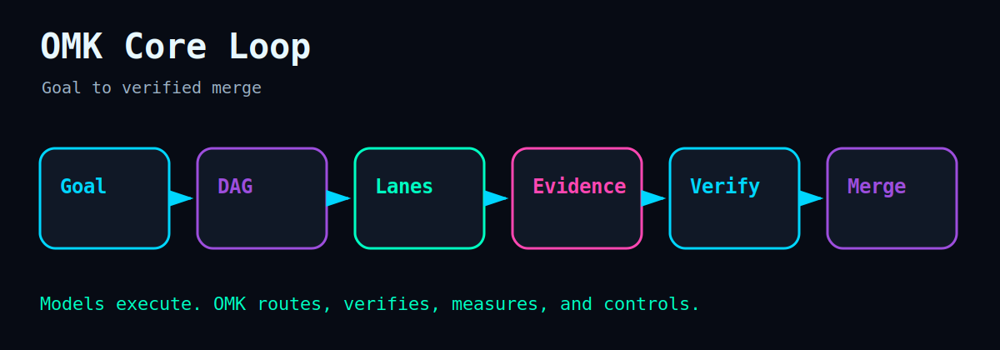

<p align="center">
  
</p>

<h1 align="center">OMK</h1>

<p align="center">
  <strong>OMK//CONTROL — provider-neutral multi-agent control plane for coding workflows.</strong>
</p>

<p align="center">
  Models execute. OMK routes, verifies, measures, and controls.
</p>

<p align="center">
  <a href="https://www.npmjs.com/package/open-multi-agent-kit"></a>
  <a href="https://www.npmjs.com/package/open-multi-agent-kit"></a>
  <a href="docs/versioning.md"></a>
  <a href="https://github.com/dmae97/open-multi-agent-kit/blob/main/proof/PROOF_INDEX.md"></a>
  <a href="LICENSE"></a>
</p>

<p align="center">
  <a href="#install">Install</a> ·
  <a href="#quick-start">Quick start</a> ·
  <a href="#who-is-this-for">Who is this for?</a> ·
  <a href="#current-runtime-algorithm">Runtime algorithm</a> ·
  <a href="docs/getting-started.md">Docs</a> ·
  <a href="readmeasset/ASSET_INDEX.md">Visual assets</a>
</p>

`OMK` (`omk`) turns a coding goal into a bounded, evidence-gated agent run.

Use OMK when one coding agent is not enough: route Codex, OpenCode, Kimi, DeepSeek, Qwen, OpenRouter, and local runtimes through one evidence-gated control loop.

## Who is this for?

- Developers running multiple coding agents from the terminal.
- Teams that need MCP-scoped agent execution instead of unrestricted tool access.
- Agent builders who want routing, fallback, evidence gates, telemetry, and replay.

> Current package source target: `open-multi-agent-kit@0.78.1`.
> Public package name: `open-multi-agent-kit` (`@omk/cli` is not the active npm package).
> Runtime contract family: `v1.2` (contract family, not a stable npm `1.x` release).
> Release channel: `pre-1.0`.
> See [versioning](docs/versioning.md) and [provider maturity](docs/provider-maturity.md).

## Quickstart (3 minutes)

A beginner reads this, runs four commands, and reaches an initialized OMK chat/doctor flow.

```bash
npm i -g open-multi-agent-kit
omk init
omk doctor
omk chat
```

## Examples for agent tooling lists

- [Codex MCP evidence run](examples/codex-mcp-evidence-run/README.md): project-scoped MCP setup plus evidence-gated DAG dry run.
- [Provider fallback](examples/provider-fallback/README.md): `--provider auto` routing with parallel worker planning.

## Current release reality

- The public npm line is `open-multi-agent-kit@0.78.x`. Published npm `latest` is `0.78.0`;
  source/target is `0.78.1` and is published only after the release workflow passes on the tagged commit.
- The `v1.2` label in docs is a runtime contract family for the source tree, not a claim that
  an npm `1.2.x` stable release exists.
- Provider support is intentionally uneven: Kimi remains the most mature authority path;
  Codex/OpenCode/CommandCode depend on local CLIs; MiMo/DeepSeek/Qwen/OpenRouter/local LLM
  lanes are scoped by the provider-maturity contract.
- Safety and evidence claims apply to the exact adapter, command, and verification gate that
  produced them.

## Why OMK

Most coding agents optimize for a single prompt/result loop. OMK wraps agent execution with a control-plane algorithm:

- compile the user goal into a DAG coordinator turn;
- inject only scoped MCP servers, skills, hooks, memory, and tools;
- classify task intent and route to compatible runtime adapters;
- execute with timeout, approval, sandbox, and fallback metadata;
- require evidence before completion claims;
- preserve run artifacts for replay, inspection, and audit.

## OMK//CONTROL visual console

The GitHub visual set presents OMK as a Night City Ops Console: route status, DAG lanes, provider fallback, scoped MCP, evidence gates, and replayable run telemetry. Assets are provenance-covered in [`readmeasset/ASSET_PROVENANCE.md`](readmeasset/ASSET_PROVENANCE.md).

<p align="center">
  
</p>

| Operator TUI                                                                                                                                                                                            | Runtime flow                                                                                                                                                                                                                            |
| ------------------------------------------------------------------------------------------------------------------------------------------------------------------------------------------------------- | --------------------------------------------------------------------------------------------------------------------------------------------------------------------------------------------------------------------------------------- |
|  |  |

| Install lane                                                                     | Provider router                                                                       | Evidence gate                                                                     |
| -------------------------------------------------------------------------------- | ------------------------------------------------------------------------------------- | --------------------------------------------------------------------------------- |
|  |  |  |

<p align="center">
  
</p>

## Install

Requires Node.js `>=20` and npm `>=10`. The [3-minute route](#quickstart-3-minutes) uses the global install; these are the alternatives:

Project/local install:

```bash
npm i open-multi-agent-kit
npx omk --help
```

No install:

```bash
npx -p open-multi-agent-kit omk doctor
```

## Quick start

The [3-minute route](#quickstart-3-minutes) is the canonical path. Beyond it, add provider auth and orchestration:

```bash
omk codex auth --choice plus-pro # optional; requires official Codex app/CLI login
omk chat --provider auto --mode agent
omk orchestrate "ship feature" --workers 4 --dry-run
```

## Current runtime algorithm

The canonical algorithm definitions live in [Native Root Runtime Algorithms](docs/native-root-runtime-algorithms.md). README summary:

### 1. Native root turn execution

```text
Read user input
  → dispatch slash commands locally
  → build scoped MCP/skills/hooks capability injection
  → build prompt envelope
  → materialize a DAG coordinator node
  → run selected runtime with timeout/abort handling
  → stream output, sync TODOs, attach evidence
```

This is the interactive root loop used by `omk chat`. It treats shell exits, slash commands, prompt envelopes, TODO sync, and recent output as controlled runtime state instead of loose chat text.

### 2. Native root turn node construction

```text
User prompt
  → infer risk: read | write | shell | merge
  → normalize scoped capabilities
  → choose provider-neutral routing policy
  → attach approval/sandbox metadata
  → produce coordinator DAG node
```

Read-only turns stay read-only. Write, shell, and merge turns get explicit capability metadata. DeepSeek-style advisory lanes are kept read/review when the risk is not safe for write authority.

### 3. Runtime-backed task runner

```text
DAG node
  → run state
  → context capsule
  → provider-neutral AgentTask
  → RuntimeRouter.execute(task)
  → TaskResult with selected runtime + fallback chain
```

OMK converts DAG context into an adapter-neutral task so Codex, MiMo, Kimi API/print lanes, DeepSeek, Qwen, OpenRouter, local adapters, or future runtimes can participate through the same contract when configured. That contract does not imply equal write/merge authority for every adapter.

### 4. Intent-aware runtime routing and fallback

```text
Classify intent
  → filter compatible runtimes
  → score by quality, evidence pass rate, and recent failures
  → execute best runtime
  → fallback in ranked order when a runtime fails
  → record selected runtime, intent, scores, and fallback chain
```

Provider routing is evidence-aware, not just provider-name matching. Failed or low-evidence lanes are penalized; compatible healthy lanes can take over.

### 5. Secure worker transport and scoped environment

```text
Worker prompt
  → stdin transport where supported, not process argv
  → scoped agent file when needed
  → sanitized child environment
  → OMK_RUN_ID / OMK_NODE_ID / OMK_NODE_ROLE metadata
```

Kimi worker prompts use stdin with `--input-format text` where that adapter path applies. All worker environment claims are scoped to the exact adapter and evidence gates; private prompt envelopes and run artifacts remain trusted local data.

## Core loop

```text
Goal → DAG plan → parallel lanes → evidence bundle → verify gate → merge / replay / inspect
```

## Goal lifecycle

`omk goal` turns a raw goal into a planned, evidence-gated run. The **OMK Deep Interview** is an uncertainty reducer that clarifies the goal before planning, so the DAG is compiled from a structured spec instead of a vague prompt.

Recommended flow:

```bash
omk goal interview "<raw goal>" --depth deep --write-spec
omk goal plan <goal-id>
omk goal run <goal-id> --provider auto --approval-policy interactive
omk goal verify <goal-id>
```

### `omk goal interview [input]`

Runs a deterministic deep interview that scores goal ambiguity (`0..1`), ranks targeted questions, assimilates answers into a structured spec delta, computes a completeness score, and (with `--write-spec`) creates or updates a `GoalSpec`. Question ranking is deterministic:

```text
score = informationGain*0.35 + riskReduction*0.25 + dagImpact*0.20 + evidenceImpact*0.15 - userCost*0.05
```

| Option                     | Purpose                                                         |
| -------------------------- | -------------------------------------------------------------- |
| `--goal-id <id>`           | Target an existing goal.                                       |
| `--mode <create\|refine>`  | Create a new spec or refine an existing one.                   |
| `--depth <light\|standard\|deep>` | Interview depth; omit to auto-select by ambiguity.      |
| `--max-questions <n>`      | Cap the number of ranked questions.                           |
| `--answers <file>`         | Supply answers non-interactively.                             |
| `--write-spec`             | Persist the spec delta into a `GoalSpec`.                     |
| `--json`                   | Emit the `omk.interview.v1` JSON contract.                    |

### `omk goal refine <goal-id>`

Applies the latest interview spec delta to a goal and optionally replans.

| Option                  | Purpose                                          |
| ----------------------- | ------------------------------------------------ |
| `--from-interview <id>` | Source interview session (default: latest).      |
| `--plan`                | Replan the goal after applying the delta.         |
| `--json`                | Emit machine-readable output.                     |

Answers file format (`--answers answers.json`):

```json
{
  "answers": [
    { "questionId": "q-success-criteria", "answer": "..." }
  ]
}
```

Session artifacts (`interview.json`, `spec-delta.json`, `questions.md`, `answers.jsonl`, `interview-report.md`) are written under `.omk/goals/<goalId>/interviews/<sessionId>/`, or `.omk/interviews/<sessionId>/` before `--write-spec`.

## What OMK controls

| Surface            | What OMK does                                                                                           |
| ------------------ | ------------------------------------------------------------------------------------------------------- |
| DAG orchestration  | Plans, routes, executes, merges, replays, and inspects agent work.                                      |
| Evidence gates     | Requires command output, diff, artifact, metric, or review proof before “done”.                         |
| Provider routing   | Selects compatible runtimes with intent, capability, evidence, and fallback metadata.                   |
| MCP scope          | Keeps project MCP, skills, hooks, and graph memory scoped instead of importing global secrets silently. |
| Worktree isolation | Keeps parallel lanes bounded, reviewable, and recoverable.                                              |
| Operator telemetry | Exposes route, status, blockers, TODOs, run health, and evidence state through CLI/HUD/TUI surfaces.    |
| Security boundary  | Sanitizes child env, protects secrets, and makes workspace-write routes explicit.                       |

## Provider lanes

OMK is provider-neutral, but providers are not equally mature or equally authorized:

- **Kimi API / print lanes**: most mature authority path and compatibility fallback when configured.
- **MiMo**: default/read-review-thinking path when configured; direct workspace-write authority is not claimed for the API runtime.
- **Codex app / CLI OAuth lanes**: compatibility path through the official Codex CLI/app login; local CLI availability and policy decide what can run.
- **OpenCode / CommandCode CLI lanes**: compatibility paths when the local CLI and auth are present.
- **DeepSeek, Qwen, OpenRouter, local LLM adapters**: advisory/read/review/QA/research lanes unless a tested contract grants more authority.
- **GPT Image 2 asset lane**: visual asset workflow only when explicitly selected and separately configured.

See [provider maturity](docs/provider-maturity.md) before treating any non-Kimi lane as an authority/write/merge path.

## Codex app / OAuth first

For Codex lanes, OMK delegates auth to the official Codex app/CLI and never reads or prints `~/.codex/auth.json` tokens.

```bash
codex login
omk codex auth --choice plus-pro --run
omk provider doctor codex --soft
```

Codex/ChatGPT OAuth is for Codex CLI sessions. `omk image generate/edit --model gpt-image-2` remains an OpenAI Images API call and requires a separate OpenAI Platform project API key. See [Codex OAuth setup](docs/codex-oauth-setup.md) and [OpenAI image keys](docs/openai-platform-image-keys.md).

## CLI and package contract

The npm package is intentionally package-safe:

| Contract          | Value                                                                                                                                                                                                                          |
| ----------------- | ------------------------------------------------------------------------------------------------------------------------------------------------------------------------------------------------------------------------------ |
| Package           | [`open-multi-agent-kit`](https://www.npmjs.com/package/open-multi-agent-kit)                                                                                                                                                   |
| Version           | `0.78.1`                                                                                                                                                                                                                       |
| Runtime contract family | `v1.2`                                                                                                                                                                                                                         |
| Bins              | `omk`, `omk-project-mcp`, `omk-acp`, `omk-mcp-host`                                                                                                                                                                            |
| Packaged docs     | `README.md`, `docs/`, `SECURITY.md`, `ROADMAP.md`, `MATURITY.md`, `DESIGN.md`                                                                                                                                                  |
| Packaged branding | Canonical hero/social/TUI/runtime images plus the curated derivative gallery documented in [`readmeasset/ASSET_INDEX.md`](readmeasset/ASSET_INDEX.md) and [`readmeasset/ASSET_PROVENANCE.md`](readmeasset/ASSET_PROVENANCE.md) |
| Excluded          | source-only tests, scripts, local state, logs, secrets, private runtime directories                                                                                                                                            |

Release checks:

```bash
npm run version:check
npm run proof:check
npm run pack:dry
npm run audit:package
```

## Contract versions

Machine-readable contracts currently include:

- `omk.contract.v1`
- `omk.evidence.v1`
- `omk.decision.v1`
- `omk.run-manifest.v1`
- `omk.provider.v1`
- `omk.version.v1`
- `omk.proof-bundle.v1`

Schemas live in the source-tree `schemas/` directory and are checked with:

```bash
npm run schema:check
```

## Known implementation caveats

The runtime algorithms are the current contract target, with adapter-specific hardening still tracked in docs and tests:

- `/provider` is restart-only in the native root loop.
- `/model` is UX debt until live mutation or restart-only behavior is enforced consistently.
- Approval and sandbox metadata are preserved in task contracts; enforcement depends on the adapter path.
- Provider health probes do not yet uniformly separate binary/API presence, auth, model support, and quota state across every adapter.
- Safety claims are scoped to exact adapter, command, evidence, and package-audit results.

## Brand system

Public copy stays OMK-owned: **OMK//CONTROL**, **NEON GRID ONLINE**, route/evidence/loop/control language, and the **Night City Ops Console** palette. The README/NPM hero, social preview, TUI mock, runtime-flow diagram, and derivative gallery are package-safe brand assets with provenance in [`readmeasset/ASSET_PROVENANCE.md`](readmeasset/ASSET_PROVENANCE.md).

## Docs

- [Getting started](docs/getting-started.md)
- [Runtime versioning](docs/versioning.md)
- [Provider maturity](docs/provider-maturity.md)
- [Native root runtime algorithms](docs/native-root-runtime-algorithms.md)
- [Codex OAuth setup](docs/codex-oauth-setup.md)
- [Ouroboros integration](docs/integrations/ouroboros.md)
- [Security policy](SECURITY.md)

## Security

Safe by default: child env is sanitized, ambient secrets are dropped, and workspace-write routes require approval. OS-level sandboxing is planned, not claimed; see [SECURITY.md](SECURITY.md).

## Links

- GitHub: <https://github.com/dmae97/open-multi-agent-kit>
- NPM: <https://www.npmjs.com/package/open-multi-agent-kit>
- Releases: <https://github.com/dmae97/open-multi-agent-kit/releases>

## License

[MIT](LICENSE)
