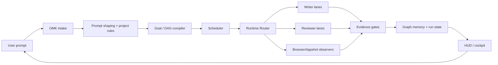

# OMK — Open Multi-agent Kit

<div align="center">

[](https://mseep.ai/app/dmae97-open_multi-agent_kit)

<!-- Open Graph -->
<meta property="og:image" content="https://raw.githubusercontent.com/dmae97/open_multi-agent_kit/main/readmeasset/omk-social-preview.png" />
<meta property="og:title" content="open_multi-agent_kit" />
<meta property="og:url" content="https://github.com/dmae97/open_multi-agent_kit/" />
<meta property="og:description" content="Provider-neutral agent runtime for coding workflows. Stable daily-use core with orchestration surfaces." />

<!-- Twitter -->
<meta name="twitter:card" content="summary_large_image" />
<meta name="twitter:image" content="https://raw.githubusercontent.com/dmae97/open_multi-agent_kit/main/readmeasset/omk-social-preview.png" />


<h1>OMK — Open Multi-agent Kit</h1>

<p><strong>Provider-neutral runtime for AI coding teams.</strong></p>
<p><sub>Agent supervisor for coding agents: DAG scheduling, evidence gates, worktree isolation, replay, and memory.</sub></p>
<p><sub>Your agents write. OMK coordinates, verifies, remembers, and guards.</sub></p>
<p><a href="https://github.com/dmae97/open_multi-agent_kit/"><strong>github.com/dmae97/open_multi-agent_kit</strong></a> · <a href="https://github.com/dmae97/open_multi-agent_kit">GitHub</a> · <a href="https://www.npmjs.com/package/open-multi-agent-kit">npm</a></p>

<p>
  <a href="https://github.com/dmae97/open_multi-agent_kit/actions/workflows/ci.yml"></a>
  <a href="https://github.com/dmae97/open_multi-agent_kit/releases"></a>
  <a href="https://www.npmjs.com/package/open-multi-agent-kit"></a>
  <a href="https://www.npmjs.com/package/open-multi-agent-kit"></a>
  <a href="./LICENSE"></a>
</p>

<p>
  
  
  
  
</p>

</div>

---

## The 10-second version

OMK turns agent CLIs and model APIs into bounded, inspectable runtime lanes with isolated worktrees, DAG-based execution, evidence gates before completion, local graph memory, and a live HUD/cockpit for operator control. It works with Codex, Gemini, Claude Code, Kimi, OpenRouter, Qwen, DeepSeek, and local models.

- Not a prompt pack.
- Not a model buffet.
- A provider-native control plane for shipping code with verification.

```bash
npm install -g open-multi-agent-kit
omk init
omk doctor
omk chat
```

Project repository and install landing page: **[github.com/dmae97/open_multi-agent_kit](https://github.com/dmae97/open_multi-agent_kit/)**.

Need the full agent harness?

```bash
omk parallel "refactor auth module with tests"
omk verify --json
omk summary-show
omk cockpit
```

> Current source target: **v1.1.18**. Latest published release remains **v1.1.17** until release gates pass. Release-prep candidate with parallel orchestration, typed doctor repair plans, startup update prompts, and native safety packaging gates; publish/tag remains gated on `npm run release:check`.

> **Share your verified run:** open a **Verified run** issue with your raw prompt, generated diff, `omk verify --json`, replay screenshot, and known limitation so others can inspect real evidence.

> ⚠️ **Global MCP instability warning:** `omk init --global` can be unstable due to global MCP server dependency resolution.
> - Input prompts during init: just press **Enter** to accept defaults.
> - Some `npx`-based MCP servers require a timeout wait (default 15s) — **do not interrupt**.
> - Global `~/.kimi/mcp.json` is injected at runtime, not modified directly.

---

## Why OMK

| Problem | OMK answer |
| --- | --- |
| Agents say "done" too early | Evidence gates require files, diffs, summaries, or passing commands before completion is accepted. |
| Parallel workers corrupt context | Run-scoped state and Git worktrees keep agent lanes isolated until review or merge. |
| Long sessions lose memory | Local graph memory stores goals, decisions, risks, commands, files, evidence, and concepts. |
| Agents need operator visibility | HUD and cockpit expose run state, TODOs, ETA, usage, workers, and changed files. |
| Extra models create chaos | Write/merge authority stays bounded; provider lanes stay advisory, review, QA, or research scoped. |
| Hooks, MCP, and skills drift | `omk doctor`, `omk skill`, `omk mcp`, and generated project assets make the runtime inspectable. |
| Repeated agent workflows stay ad hoc | Packaged OMK skills now cover memory, surgical coding, alignment/TDD, React diagnostics, managed-agent teamwork, legal workflows, quality gates, and release review. |

**Mental model:** Your agents write. OMK coordinates, verifies, remembers, and guards.

---

## CLI screenshots

### Live HUD


### Sidecar cockpit


### Graph memory viewer


### Open Design bridge


### Parallel execution


---

## Current CLI shape

```text
Start Here
  omk menu       Interactive OMK main menu
  omk init       Project scaffold: AGENTS.md, DESIGN.md, .omk/
  omk doctor     Environment check: CLI, Git, hooks, MCP, skills, providers
  omk chat       Agent interactive execution
  omk plan       Plan-only execution
  omk hud        Execution status and system usage HUD
  omk mode       Switch execution presets (agent, plan, chat, debug, review)

Stable / daily-use
  omk cockpit    Sidecar cockpit for run state, TODOs, and ETA
  omk design     DESIGN.md and Open Design integration
  omk lsp        Built-in TypeScript LSP run/config output
  omk runs       List past OMK runs with status and dates
  omk history    Alias for runs with filters and export

Advanced / inspectable
  omk graph      Inspect OMK ontology graph
  omk mcp        Inspect MCP configuration and server health
  omk replay     Timeline-based run replay from artifacts
  omk inspect    Forensic run inspection with deep-dive flags
  omk diff-runs  Structural diff between two runs for reproducibility
  omk agent      Agent role listing/show/create/doctor
  omk snip       Snippet save/get/list/search/delete
  omk servarr    Optional Radarr/Sonarr/Lidarr read-only adapter

Orchestration
  omk parallel   Parallel coordinator + workers + reviewer
  omk run        DAG-based long-running task execution
  omk verify     Evidence-gate verification for a run
  omk goal       Goal lifecycle management
  omk team       tmux-based multi-agent team execution
  omk research   Web research wrapper
  omk spec       GitHub Spec Kit bridge
```

Stable and daily-use commands are the normal operator path. Advanced and orchestration commands expose stronger orchestration primitives without pretending every surface has the same maturity level.

---

## How the engine works



## Runtime adapters

OMK supports multiple agent runtimes through a unified adapter interface:

- **Codex CLI** — OpenAI Codex integration.
- **Gemini CLI** — Google Gemini agent runtime.
- **Claude Code** — Anthropic Claude Code adapter.
- **Kimi CLI** — First-class adapter for MCP-heavy execution and Kimi users.
- **OpenRouter** — OpenRouter API adapter for multi-model routing.
- **Qwen** — Alibaba Qwen API adapter.
- **DeepSeek** — DeepSeek advisory/read-only adapter.

### 1. Provider-native control plane

OMK is built around your agent provider instead of treating it as a generic backend. Project rules, generated agents, hooks, slash skills, MCP configuration, and run state are shaped so the primary writer remains bounded by OMK state, safety hooks, graph memory, and evidence gates.

### 2. DAG execution

A request can become a task graph instead of a single linear prompt. Nodes can carry roles, dependencies, retries, fallback routing, timeout presets, heartbeat monitoring, and evidence requirements. This makes long-running work explicit enough to inspect, resume, verify, or block.

### 3. Evidence gates

OMK does not accept completion by narration alone. A node can require evidence such as:

- file exists
- command passes
- git diff is non-empty
- summary or evidence marker is present

If evidence fails, the runtime can retry, skip, block dependents, or route to fallback handling.

### 4. Decision trace coverage

Every policy decision — routing, context brokering, repair, scheduling, provider selection, ensemble decisions, and skill assignment — is recorded in `.omk/runs/<runId>/decisions.jsonl`. This makes runs inspectable and reproducible rather than opaque.

### 5. Context brokering and budget optimization

OMK manages context as bounded capsules rather than unbounded conversation history. The context broker shapes what each agent receives based on role and task, while the budget optimizer estimates tokens before expensive calls to prevent runaway context accumulation.

### 6. Local graph memory

OMK stores durable project memory as a graph: goals, decisions, risks, tasks, commands, files, evidence, and concepts. The graph gives the primary writer a smaller, safer context target before editing a large repository.

### 7. Worktree isolation

Parallel lanes can run in isolated Git worktrees. That keeps experiments reversible and makes review/merge a deliberate step instead of a side effect of several agents editing the same files at once.

### 8. Skills, hooks, MCP, and agents as runtime inputs

**Every OMK generated agent carries MCP, skills, and hooks capability flags, but availability is scoped by runtime and harness policy.** Every generated subagent — `explorer`, `planner`, `router`, `coder`, `reviewer`, `qa`, `tester`, `researcher`, `security`, `integrator`, `aggregator`, `interviewer`, `ontology`, `vision-debugger`, `architect` — inherits scoped MCP, skills, and hooks access when enabled by runtime scope.

**Parallel subagent orchestration:** the root coordinator can summon parallel subagents with independent context lanes, each with their own MCP/skills/hooks scope. Workers do not share mutable context; they operate in isolated lanes until evidence is reviewed and merged.

OMK treats project instructions, agent skills, generated hooks, and MCP servers as part of the control plane:

- `AGENTS.md` and `DESIGN.md` define project behavior and UI taste.
- `.omk/` stores run state, memory, plans, reports, and generated runtime assets.
- Default preset `omk-core-verified` is the current conservative core loop: repo/context/control-loop/plan/quality/review/test/Python-typing skills, shell/secret/stop/subagent/format hooks, and project-local `omk-project` MCP as the baseline hint. Broader MCP surfaces stay opt-in through product/team/release/high-trust presets or explicit local-user scope.
- Product preset `omk-ts-product` adds strict TypeScript, React/Next/Nest, API DTO/domain/persistence, UI review/design-system skills, typecheck/eslint hooks, and `playwright` MCP for UI verification.
- Team preset `omk-worktree-team` routes parallel worker lanes into isolated Git worktrees with branch snapshots, subagent audit, merge-quality gates, GitHub/memory, and read-only filesystem MCP hints.
- Release preset `omk-release-guard` narrows release/security work to secret and security review skills, guarded shell/publish hooks, audit/checklist evidence, and GitHub/OMK/fetch/Context7 MCP hints; it treats reference MCP servers as advisory examples rather than production-ready trust boundaries and does not auto-publish.
- Top-priority skill pack `omk-priority` installs the 12 repeatable SKILL.md workflows for context capsules, targeted repo discovery, control-loop planning, plan-first execution, quality gates, test debugging, code/security/secret review, TypeScript/Python typing, and isolated worktree teams. These are advertised as skills, not always-loaded prompt body.
- Agentic operations skill pack `omk-agentic-ops` installs the custom AdaptOrch/OMK orchestration review, task evidence contract, and control-loop debugger skills for DAG runtime, evidence-gate, and repair-policy analysis.
- `omk skill` manages Kimi-facing skills and slash workflows.
- **Skill Assigner** automatically matches skills, MCP servers, tools, and hooks to DAG nodes based on intent and role (17 rules covering core/product/team presets, web-design, diagram-design, code-review, security-audit, debugging, and more).
- `omk mcp` inspects project and user MCP configuration.
- `omk doctor` checks providers, Git, hooks, MCP, skills, and runtime health.

### 9. Ensemble decisions and repair policy

When multiple agents can work on the same node, the ensemble runner evaluates progress, risk, resource utilization, and quality across weighted analytical perspectives. If evidence fails, the repair policy decides whether to retry with context, skip, block dependents, or route to fallback handling — all recorded in decision traces.

### 10. Live operator visibility

`omk hud` and `omk cockpit` expose active work instead of hiding agent state inside logs. The goal is simple: humans should see what is running, what changed, what is blocked, and what still needs proof.

### 11. Advisory provider lanes

OMK can route research, review, QA, or risk analysis through provider lanes such as DeepSeek, but the run stays bounded. The primary writer keeps write/merge authority, and external model output is advisory evidence rather than uncontrolled patch authority.

### 12. Open Design bridge

`omk design open-design --open` launches a local Open Design workflow and connects it back to OMK. Use it when the task needs a visual design surface, then bring the output through DESIGN.md-aware implementation and quality gates.

Use `omk design open-design --doctor --json` for a side-effect-free readiness check. The bridge supports `--ref <branch|tag|sha>` / `OMK_OPEN_DESIGN_REF` for reproducible upstream checkouts; current tested Open Design main is `3f7a05e7462f097bf38b7cbac0d4a4593deecd80`. Image/screenshot inputs are forwarded as local `--image` paths, and timeout success is limited to `.omk/open-design-artifacts/<run-id>/` or an explicit `--artifact-dir`.

### 13. Run replay and inspection

`omk replay`, `omk inspect`, and `omk diff-runs` turn run artifacts into an inspectable timeline. Replay reconstructs chronology; inspect deep-dives into context, evidence, decisions, and repair chains; diff-runs compares two manifests for reproducibility debugging.

### 14. Native safety path

OMK includes a Rust native safety loader path and CI-backed artifact matrix. JavaScript remains the CLI surface; native safety helpers are selected when available and fall back safely when they are not.

---

## Five operating rituals

| Ritual | Use when | Commands |
| --- | --- | --- |
| **Ship** | You want an agent to implement with verification | `omk chat`, `omk parallel "..."`, `omk verify` |
| **Inspect** | You need run history or current state | `omk runs`, `omk replay`, `omk inspect`, `omk diff-runs`, `omk summary-show`, `omk hud` |
| **Design** | You need visual/product direction | `omk design`, `omk design open-design --open` |
| **Remember** | You need durable project context | `omk graph view --open`, `omk index` |
| **Guard** | You need safety and release confidence | `omk doctor`, `npm run release:check`, `omk review` |

---

## Example: one prompt to a verified run

```bash
omk init
omk doctor
omk plan "Add a settings page with tests"
omk parallel "Implement the settings page from the plan"
omk verify --json
omk summary-show
```

Expected operator loop:

1. OMK loads project rules, skills, hooks, MCP status, and current Git state.
2. The active agent receives a shaped prompt with explicit constraints.
3. The scheduler creates bounded lanes for implementation, review, or QA.
4. Evidence gates check required files, diffs, summaries, or commands.
5. Graph memory records decisions, risks, files, and evidence for the next run.
6. HUD/cockpit shows progress and remaining blockers.

---

## Reproducible examples

| Example | Prompt -> output | Artifact |
| --- | --- | --- |
| [One-prompt landing page](https://github.com/dmae97/open_multi-agent_kit/tree/main/examples/one-prompt-landing-page) | Next.js + Tailwind landing page from a single sentence | `RUN_REPORT.md`, video, known limitations |
| [Neon Courier 2D](https://github.com/dmae97/open_multi-agent_kit/tree/main/examples/neon-courier-2d) | Browser 2D runner game in TypeScript | `RUN_REPORT.md`, source, known limitations |
| [Neon Courier FPS](https://github.com/dmae97/open_multi-agent_kit/tree/main/examples/neon-courier-fps) | Three.js first-person prototype | `RUN_REPORT.md`, source, known limitations |


OMK examples are intentionally honest: prompts, generated outputs, run reports, and known limitations stay visible.

---

## How OMK differs from other oh-my harnesses

| Harness | Best when | Core idea |
| --- | --- | --- |
| OMC | You live inside Claude Code | Team-first Claude Code orchestration |
| OMX | You want a stronger Codex CLI workflow | Codex workflow layer with reusable modes |
| OMO | You want open multi-model routing | Open multi-model agent team with aggressive routing |
| OMK | You want verified agent execution | Provider-neutral DAG runtime with evidence gates and graph memory |

OMK is provider-neutral. Any supported model can advise, review, or QA, and the run remains bounded by OMK state, safety hooks, graph memory, and evidence gates.

---

## Installation

```bash
npm install -g open-multi-agent-kit
omk --version
omk doctor
```

Requirements:

- Node.js 20+
- Git
- At least one supported agent provider (Kimi, Codex, Gemini, Claude Code, OpenRouter, etc.) installed and authenticated
- tmux for team/HUD workflows on Unix-like systems
- Node.js 24 when launching upstream Open Design locally

Project bootstrap:

```bash
mkdir my-project
cd my-project
omk init
omk doctor
```

Optional DeepSeek advisory setup:

```bash
printf '%s' "$DEEPSEEK_API_KEY" | omk deepseek api
omk deepseek doctor --soft
```

Do not commit provider keys. Keep secrets in environment variables, local keychains, or ignored local config.

OpenAI image generation uses a Platform project API key, not Codex/ChatGPT OAuth. For `omk image generate/edit`, inject an ephemeral `OPENAI_API_KEY` for one command, then unset it; see [OpenAI Platform keys for image generation](./docs/openai-platform-image-keys.md).

The Open Design bridge does not pass inherited `OPENAI_API_KEY`, OAuth tokens, `*_TOKEN`, `*_SECRET`, or `*_KEY` env vars to its child process by default. Only set `OMK_OPEN_DESIGN_TRUST_SECRET_ENV=1` for a trusted local run that intentionally needs secret env inheritance.

---

## Command map

| Area | Commands |
| --- | --- |
| Bootstrap | `omk init`, `omk doctor`, `omk menu`, `omk update`, `omk star` |
| Agent execution | `omk chat`, `omk plan`, `omk parallel`, `omk run` |
| Verification | `omk verify`, `omk review`, `npm run verify`, `npm run release:check` |
| Operator UI | `omk hud`, `omk cockpit`, `omk runs`, `omk summary`, `omk summary-show` |
| Replay & diff | `omk replay`, `omk inspect`, `omk diff-runs` |
| Context | `omk index`, `omk graph`, `omk sync`, `omk skill` |
| Providers | `omk provider`, `omk deepseek`, `omk research` |
| Design | `omk design`, `omk design open-design --open`, `omk open-design-agent` |
| Advanced | `omk goal`, `omk dag`, `omk team`, `omk merge`, `omk screenshot`, `omk cron`, `omk specify` |
| Tools & presets | `omk mode`, `omk snip`, `omk agent` |
| Workflow presets | `omk feature`, `omk bugfix`, `omk refactor` |

---

## Safety and maturity

OMK has a stable daily-use core, with advanced surfaces explicitly labelled by maturity:

- **Stable / daily-use core:** init, doctor, chat, plan, mode, runs, history, index-show, cockpit, HUD, design, LSP, index, star, update, google, and project inspection surfaces.
- **Advanced inspection:** graph, MCP, replay, inspect, diff-runs, snip, screenshots, provider diagnostics, and design bridges are inspectable but may depend on local project assets.
- **Orchestration:** parallel, run, verify, review, goal, sync, summary, and long-running evidence-gated flows.
- **Advanced surfaces:** tmux team mode, merge automation, agent registry, skill manager, research, feature/bugfix/refactor workflows, spec/DAG/cron, open-design-agent, and provider-routing integrations.

Release asset policy: `public/assets/**` is source-only reference material and is intentionally ignored and forbidden from npm package audit until license/provenance is recorded. Existing `readmeasset/` and `docs/assets/` files remain the package-safe documentation asset locations.

Release confidence is built from local and CI gates:

```bash
npm run verify
npm run native:build
npm run pack:dry
npm run audit:package
npm run smoke:pack
npm run release:check
```

The v1.1.18 source target is release-gated and evidence-gated: it strengthens parallel subagent orchestration, typed `omk doctor --fix` repair plans with dry-run and post-fix verification, shared startup update prompts, memory/capability harness summaries, and native safety package readiness while preserving package audit, smoke-pack checks, native safety normalization, replay/inspect/diff-runs, skill assigner, decision trace coverage, and CI release gates. Do not claim v1.1.18 as published until native safety packaging, package audit, smoke-pack, tarball install smoke, and `npm run release:check` evidence pass; latest published release remains v1.1.17 until then.

**MCP fetch startup note:** if your personal agent config still starts fetch with `uvx mcp-server-fetch`, each disposable or isolated Kimi HOME may re-resolve Python dependencies before MCP tools appear. Prefer a persistent entrypoint:

```bash
uv tool install mcp-server-fetch
```

Then set `~/.kimi/mcp.json` to an absolute command such as `/home/you/.local/bin/mcp-server-fetch`. Keep project `.kimi/mcp.json` files from redefining the same `fetch` server unless the project intentionally overrides the user-level server.

**MCP PDF startup note:** `@modelcontextprotocol/server-pdf` defaults to Streamable HTTP and may print `MCP server listening on http://localhost:3001/mcp` to stdout, which breaks stdio JSON-RPC clients. OMK installs it with `--stdio`; existing configs should add that arg or configure PDF as a remote URL.

---

## Documentation

- [Getting started](./docs/getting-started.md)
- [Verified-run demo evidence skeleton](./docs/demo/verified-run/README.md)
- [Current workflow skills](./templates/skills/kimi/agentmemory/SKILL.md)
- [Local graph memory](./docs/local-graph-memory.md)
- [HUD and parallel UX](./docs/hud-and-parallel-ux.md)
- [Design and Open Design workflow](./docs/design-md.md)
- [Kimi OAuth and usage status](./docs/kimi-oauth-usage-status.md)
- [Roadmap](./ROADMAP.md)
- [Maturity](./MATURITY.md)
- [Security](./SECURITY.md)

---

## Repository topics

`agent-runtime` · `provider-neutral` · `coding-agents` · `dag-runtime` · `evidence-gates` · `multi-agent-orchestration` · `agent-supervisor` · `multi-provider` · `verified-agent-runtime` · `dag-execution` · `graph-memory` · `worktree-isolation` · `mcp` · `agent-skills` · `safety-hooks` · `open-design` · `deepseek-advisory`

---

## Acknowledgements

OMK is part of the broader oh-my agent harness family. It is built for developers who want stronger execution state, verification, memory, and operator visibility from any supported coding agent, without giving up the primary writer as the bounded coding authority.

---

## Star history

[](https://www.star-history.com/#dmae97/open_multi-agent_kit&Date)
